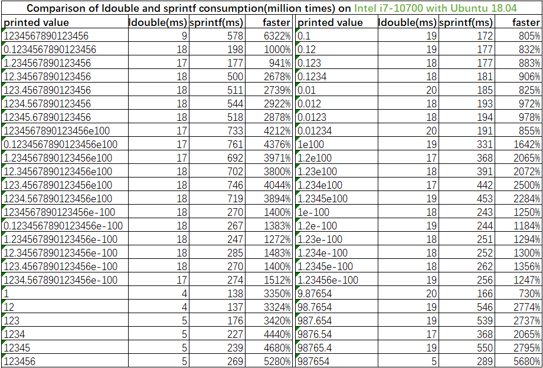

# LJSON Description

[中文版](./README_zh-cn.md)

LJSON is a C implemented JSON library that is much faster than cJSON and substantially faster than RapidJSON, it is currently the fastest general-purpose JSON library and supports all JSON5 features.
LJSON supports JSON parsing, printing and editing, provides DOM and SAX APIs, and I/O supports string and file, it fully supports the test cases of nativejson-benchmark.
By default, LJSON uses the personally developed ldouble algorithm to print double to string. Compared with the standard library, it may only be the 15th decimal place difference. It is currently the fastest double to string algorithm; users can also choose the personally optimized grisu2 algorithm or dragonbox algorithm.

## Features

* Faster: Print and parse faster than both cJSON and RapidJSON, up to **32** times faster than CJSON and **1.5** time faster than Rapid JSON, refer to below test results
* Lighter: Provide a variety of methods to save memory, such as pool memory, file parsing while reading, file writing while printing, and SAX APIs. It can make memory usage a constant
* Stronger: Support DOM and SAX-style APIs, provide APIs for JSON in classic mode and memory pool mode, support string and file as input and output, is extended to support long long integer and hexadecimal number
* More friendly: C language implementation, does not depend on any other library, does not contain platform-related code, only one header file and source file, and the interface corresponding to cJSON. the code logic is clearer than any other JSON libraries
* JSON5: Supports all JSON5 features, such as hexadecimal digits, comments, array and object tail element comma, single quoted string/key and unquoted key

## Compile and Run

### Compile Method

* Compile directly

```sh
gcc -o ljson json.c -jnum.c json_test.c -lm -O2 -ffunction-sections -fdata-sections -W -Wall
```

* Compile with [IMAKE](https://github.com/lengjingzju/cbuild-ng)

```sh
make O=<output path> && make O=<output path> DESTDIR=<install path>
```

* Cross Compile

```sh
make O=<output path> CROSS_COMPILE=<tool prefix> && make O=<output path> DESTDIR=<install path>
```

* Select double to string algorithm `gcc -DJSON_DTOA_ALGORITHM=n`, n may be 0 / 1 / 2 / 3
    * 0: Personal implementation of ldouble algorithm: faster than Google's default implementation of grisu2 **129%** , faster than Tencent optimized grisu2 implementation **33%**, faster than sprintf **14.6** times
    * 1: C standard library sprintf
    * 2: Personal optimized grisu2 algorithm: Google's grisu2 default implementation is **5.7** times faster than sprintf, Tencent optimized grisu2 implementation is **9.1** times faster than sprintf, LJSON optimized implementation is faster than sprintf **11.4** times
    * 3: Personal optimized dragonbox algorithm: the speed performance is slower than ldouble algorithm, but faster than grisu2 algorithm

### Run Method

```sh
./ljson <json filename> <test index:0-7>
```

### Debug Method

* Set the value of the variable `JSON_ERROR_PRINT_ENABLE` in `json.c` to `1` and then re-compile

### Parse Config

* `#define JSON_PARSE_SKIP_COMMENT         1` : Whether to allow C-like single-line comments and multi-line comments(JSON5 feature)
* `#define JSON_PARSE_LAST_COMMA           1` : Whether to allow comma in last element of array or object(JSON5 feature)
* `#define JSON_PARSE_EMPTY_KEY            0` : Whether to allow empty key
* `#define JSON_PARSE_SPECIAL_CHAR         1` : Whether to allow special characters such as newline in the string(JSON5 feature)
* `#define JSON_PARSE_SPECIAL_QUOTES       1` : Whether to allow single quoted string/key and unquoted key(JSON5 feature)
* `#define JSON_PARSE_HEX_NUM              1` : Whether to allow HEX number(JSON5 feature)
* `#define JSON_PARSE_SPECIAL_NUM          1` :Whether to allow special number such as starting with '.', '+', '0', for example: `+99` `.1234` `10.` `001`(JSON5 feature)
* `#define JSON_PARSE_SPECIAL_DOUBLE       1` : Whether to allow special double such as `NaN`, `Infinity`, `-Infinity`(JSON5 feature)
* `#define JSON_PARSE_SINGLE_VALUE         1` : Whether to allow json starting with non-array and non-object
* `#define JSON_PARSE_FINISHED_CHAR        0` : Whether to allow characters other than spaces after finishing parsing

Note:
* It 100% matches the test cases of [nativejson-benchmark](https://github.com/miloyip/nativejson-benchmark) when only `JSON_PARSE_EMPTY_KEY` is set to 1, all others are set to 0.
* Setting `JSON_PARSE_SKIP_COMMENT` and `JSON_PARSE_SPECIAL_QUOTES` to 1 will significantly affect the parsing speed.

## Speed Test

### Test Code

Other json test codes are located in the benchmark directory. Just put the corresponding source file in the root directory of the corresponding json project.

```sh
gcc -o cjson cjson_test.c cJSON.c -O2               # cJSON
g++ -o rapidjson rapidjson_test.c -Iinclude -O2     # RapidJSON
gcc -o yyjson yyjson_test.c src/yyjson.c -Isrc -O2  # yyjson
gcc -o strdup strdup_test.c -O2                     # strdup和strlen
```

Test Script

```sh
#!/bin/bash

src=$1

if [ -z $src ] || [ ! -e $src ]; then
	echo "Usage: $0 <json file>"
	exit 1
fi

run_cmd() {
	printf "%-15s " $1
	eval $@
	sync
	sleep 0.1
}

for i in `seq 1 7`; do
	run_cmd ./ljson $src $i
done

run_cmd ./cjson $src
run_cmd ./rapidjson $src
run_cmd ./yyjson $src
run_cmd ./yyjson $src 1
run_cmd ./strdup $src
```

Test Mode

* ljson provides 7 test modes
    * 1: Normal DOM mode, use malloc to apply for memory, parse and print string
    * 2: Fast DOM mode, apply for large memory, then allocate memory from large memory (cannot free small memory alone), parse and print string
    * 3: Reuse DOM mode, apply for large memory, then allocate memory from large memory (cannot free small memory alone), and reuse the original parsed string for key and string value, parse and print string
    * 4: File DOM mode, no need to read the file before parsing or print before writing, use malloc to apply for memory, read file and parse json at the same time, and print json and write file at the same time
    * 5: Fast file DOM mode, no need to read the file before parsing or print before writing, apply for large memory, then allocate memory from large memory (cannot free small memory alone), read file and parse json at the same time, and print json and write file at the same time
    * 6: Normal SAX mode, parse and print string
    * 7: File SAX mode, no need to read the file before parsing, read file and parse json at the same time
* yyjson provides two test modes: unmutable and mutable

### Test Result

Note: 'O2' optimization level and default option compilation, the test files come from the [nativejson-benchmark](https://github.com/miloyip/nativejson-benchmark) project.

> Test Platform: ARM64 Development Board | CPU: ARM CortexA53 | OS: Linux-5.15<br>
> Test Result: LJSON parses 475% faster and prints 2836% faster than cJSON, LJSON parses 131% faster and prints 147% faster than RapidJSON (include file reading and writing)


> Test Platform: PC | CPU: Intel i7-10700 | OS: Ubuntu 18.04 (VirtualBox)<br>
> Test Result: LJSON parses 560% faster and prints 3184% faster than cJSON, LJSON parses 75% faster and prints 133% faster than RapidJSON
(include file reading and writing)




> Test Platform: PC | CPU: Intel i7-1260P | OS: Ubuntu 20.04 (VMWare)<br>
> Test Result: LJSON parses 510% faster and prints 2273% faster than cJSON, LJSON parses 76% faster and prints 144% faster than RapidJSON
(not include file reading and writing)


## Contact

* Phone: +86 18368887550
* wx/qq: 1083936981
* Email: lengjingzju@163.com 3090101217@zju.edu.cn
