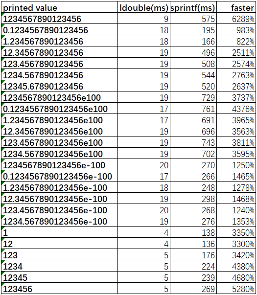

# LJSON Description

[中文版](./README_zh-cn.md)

LJSON is a C implemented JSON library that is much faster than cJSON and substantially faster than RapidJSON, it is currently the fastest general-purpose JSON library.
LJSON supports JSON parsing, printing and editing, provides DOM and SAX APIs, and I/O supports string and file, it fully supports the test cases of nativejson-benchmark.
By default, LJSON uses the personally developed ldouble algorithm to print double to string. Compared with the standard library, it may only be the 15th decimal place difference. It is currently the fastest double to string algorithm; users can also choose the personally optimized grisu2 algorithm or dragonbox algorithm.

## Features

* Faster: Print and parse faster than both cJSON and RapidJSON, up to **32** times faster than CJSON and **1.5** time faster than Rapid JSON, refer to below test results
* Lighter: Provide a variety of methods to save memory, such as pool memory, file parsing while reading, file writing while printing, and SAX APIs. It can make memory usage a constant
* Stronger: Support DOM and SAX-style APIs, provide APIs for JSON in classic mode and memory pool mode, support string and file as input and output, is extended to support long long integer and hexadecimal number
* More friendly: C language implementation, does not depend on any other library, does not contain platform-related code, only one header file and source file, and the interface corresponding to cJSON. the code logic is clearer than any other JSON libraries

## Compile and Run

### Compile Method

* Compile directly

```sh
gcc -o ljson json.c json_test.c -O2 -ffunction-sections -fdata-sections -W -Wall
```

* Compile with [IMAKE](https://github.com/lengjingzju/cbuild-ng)

```sh
make O=<output path> && make O=<output path> DESTDIR=<install path>
```

* Cross Compile

```sh
make O=<output path> CROSS_COMPILE=<tool prefix> && make O=<output path> DESTDIR=<install path>
```

* Select double to string algorithm `gcc -DJSON_DTOA_ALGORITHM=n`, n may be 0 / 1 / 2 / 3
    * 0: Personal implementation of ldouble algorithm: faster than Google's default implementation of grisu2 **129%** , faster than Tencent optimized grisu2 implementation **33%**, faster than sprintf **14.6** times
    * 1: C standard library sprintf
    * 2: Personal optimized grisu2 algorithm: Google's grisu2 default implementation is **5.7** times faster than sprintf, Tencent optimized grisu2 implementation is **9.1** times faster than sprintf, LJSON optimized implementation is faster than sprintf **11.4** times
    * 3: Personal optimized dragonbox algorithm: the speed performance is slower than ldouble algorithm, but faster than grisu2 algorithm

### Run Method

```sh
./json <json filename> <test index:0-7>
```

### Debug Method

* Set the value of the variable `JSON_ERROR_PRINT_ENABLE` in `json.c` to `1` and then re-compile

### Error detection

* Set the value of the variable `JSON_STRICT_PARSE_MODE` in `json.c` to `0` / `1` / `2` and then re-compile
    * 0: Turn off not common error detection, such as trailing characters left after parsing
    * 1: Detect more errors and allow key to be empty string
    * 2: In addition to error detection enabled by 1, some non-standard features are also turned off, such as hexadecimal numbers, the first json object is not an array or object
        * It 100% matches the test cases of  [nativejson-benchmark](https://github.com/miloyip/nativejson-benchmark) when set to 2

## Speed Test

Note: 'O2' optimization level and default option compilation, the test files come from the [nativejson-benchmark](https://github.com/miloyip/nativejson-benchmark) project

> Test Platform: Ambarella CV25M Board | CPU: ARM CortexA53 | OS: Linux-5.15<br>
> Test Result: LJSON parses 475% faster and prints 2836% faster than cJSON, LJSON parses 131% faster and prints 147% faster than RapidJSON


> Test Platform: PC | CPU: Intel i7-10700 | OS: Ubuntu 18.04 (VirtualBox)<br>
> Test Result: LJSON parses 560% faster and prints 3184% faster than cJSON, LJSON parses 75% faster and prints 133% faster than RapidJSON




## Contact

* Phone: +86 18368887550
* wx/qq: 1083936981
* Email: lengjingzju@163.com 3090101217@zju.edu.cn
