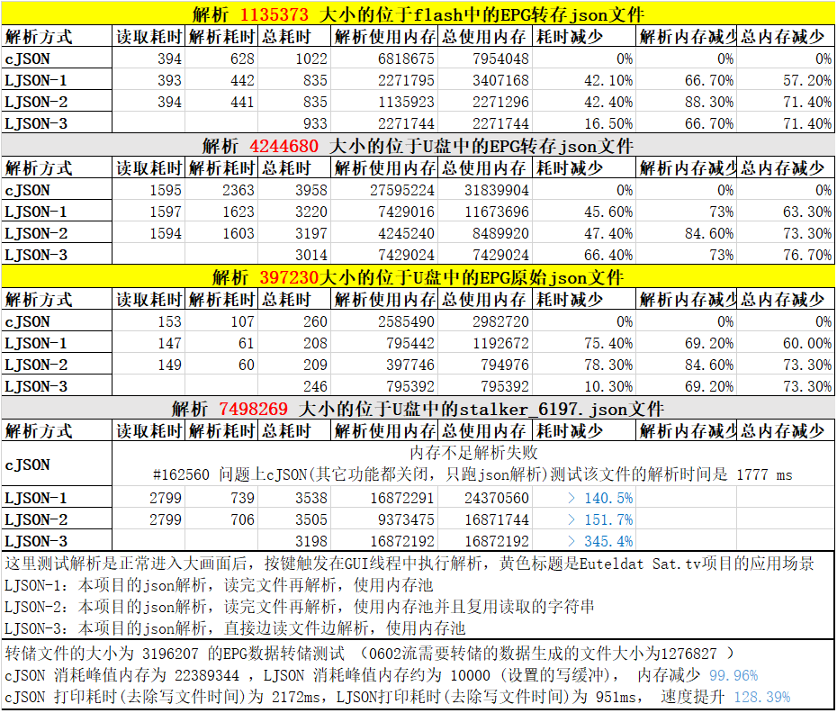

# LJSON 接口和使用说明

## 功能特点

* 比cJSON更快，更省内存
* 支持边读文件边解析成json节点树
* 支持json节点树边打印边输出到文件
* 接口和cJSON一样友好，代码逻辑比cJSON更清晰，代码大小基本无增大
* json解析和打印接口是弹性的，可以设置参数，提高特定类型的json的解析效率
* 除提供类似cJSON的经典接口外，另外提供一套使用内存池的接口
* 同时提供`DOM`风格的和`SAX`风格的APIs

## 性能测试

### 编译方法

> gcc -o json json.c json_test.c -lm -O2 -ffunction-sections -fdata-sections -W -Wall

### 运行方法

> ./json <json文件名> <测试序号0-7>

### 测试平台

> Nationalchip STB | CPU: CSKY | DDR3: 128MB, 533MHz | OS: ECOS

### 测试结果



## json对象结构

```C
struct json_list_head {
    struct json_list_head *next, *prev;
};                                      // 双向链表

typedef enum {
    JSON_NULL = 0,
    JSON_BOOL,
    JSON_INT,
    JSON_HEX,
    JSON_DOUBLE,
    JSON_STRING,
    JSON_ARRAY,
    JSON_OBJECT
} json_type_t;                          // json对象类型

typedef union {
    json_bool_t vbool;
    int vint;
    unsigned int vhex;
    double vdbl;
} json_number_t;                        // json数字对象值

typedef union {
    json_number_t vnum;                 // json数字对象的值
    char *vstr;                         // json字符串对象的值
    struct json_list_head head;         // json结构体/数组对象的值
} json_value_t;                         // json对象值

typedef struct {
    struct json_list_head list;         // json链表节点
    char *key;                          // json对象的key
    json_type_t type;                   // json对象的类型
    json_value_t value;                 // json对象的值
} json_object;                          // json对象
```

* 使用双向链表管理json节点树，类似linux内核的list.h

## 经典编辑模式接口

```C
int json_item_total_get(json_object *json);
int json_change_key(json_object *json, const char *key);
int json_change_string(json_object *json, const char *str);
```

* json_item_total_get: 获取节点总数
* json_change_key: 修改节点的key(非array类型的子节点才有key)
* json_change_string: 修改string类型节点的value

```C
void json_del_object(json_object *json);
json_object *json_new_object(json_type_t type);
json_object *json_create_item(json_type_t type, void *value);
static inline json_object *json_create_null(void);
static inline json_object *json_create_bool(json_bool_t value);
static inline json_object *json_create_int(int value);
static inline json_object *json_create_hex(unsigned int value);
static inline json_object *json_create_double(double value);
static inline json_object *json_create_string(const char *value);
static inline json_object *json_create_array(void);
static inline json_object *json_create_object(void);
```

* json_del_object: 删除节点(并递归删除子节点)
* json_new_object: 创建指定类型的空节点
* json_create_item: 创建指定类型的有值节点
* 要点：创建的节点使用完后需要使用`json_del_object`删除，但是如果把该节点加入了array或object，该节点无需再删除

```C
json_object *json_create_item_array(json_type_t type, void *values, int count);
static inline json_object *json_create_bool_array(json_bool_t *values, int count);
static inline json_object *json_create_int_array(int *values, int count);
static inline json_object *json_create_hex_array(unsigned int *values, int count);
static inline json_object *json_create_double_array(double *values, int count);
static inline json_object *json_create_string_array(char **values, int count);
```

* json_create_item_array: 快速创建指定类型的数组节点，使用要点同上

```C
int json_get_number_value(json_object *json, json_type_t type, void *value);
static inline json_bool_t json_get_bool_value(json_object *json);
static inline int json_get_int_value(json_object *json);
static inline unsigned int json_get_hex_value(json_object *json);
static inline double json_get_double_value(json_object *json);

int json_change_number_value(json_object *json, json_type_t type, void *value);
int json_strict_change_number_value(json_object *json, json_type_t type, void *value);
static inline int json_change_bool_value(json_object *json, json_bool_t value);
static inline int json_change_int_value(json_object *json, int value);
static inline int json_change_hex_value(json_object *json, unsigned int value);
static inline int json_change_double_value(json_object *json, double value);
```

* json_get_number_value: 获取number类型节点的value，返回值: 1表示成功有强制转换，0表示成功类型对应，-1表示失败不是number类型
* json_change_number_value: 修改number类型节点的value，返回值说明同上
* json_strict_change_number_value: 修改number类型节点的value，返回值: 0表示成功类型对应，-1表示失败类型不对应
  
```C
int json_get_array_size(json_object *json);
json_object *json_get_array_item(json_object *json, int seq);
json_object *json_get_object_item(json_object *json, const char *key);
```

* json_get_array_size: 获取array类型节点的大小(有多少个一级子节点)
* json_get_array_item: 获取array类型节点的的第seq个子节点
* json_get_object_item: 获取object类型节点的指定key的子节点

```C
json_object *json_detach_item_from_array(json_object *json, int seq);
json_object *json_detach_item_from_object(json_object *json, const char *key);
```

* 将指定的子节点从array或object取下并返回
* 使用完成后`需要`使用`json_del_object`删除返回的子节点
* 注：使用内存cache的json`不需要`调用`json_del_object`删除返回的子节点

```C
int json_del_item_from_array(json_object *json, int seq);
int json_del_item_from_object(json_object *json, const char *key);
```

* 将指定的子节点从array或object删除

```C
int json_replace_item_in_array(json_object *array, int seq, json_object *new_item);
int json_replace_item_in_object(json_object *object, const char *key, json_object *new_item);
```

* 将array或object指定的子节点替换成new_item
* 如果原来的子节点不存在就直接新增new_item

```C
int json_add_item_to_array(json_object *array, json_object *item);
int json_add_item_to_object(json_object *object, const char *key, json_object *item);
```

* 将节点加入到array或object
* 如果该节点加入成功，`无需`再调用`json_del_object`删除该节点

```C
json_object *json_deepcopy(json_object *json);
int json_copy_item_to_array(json_object *array, json_object *item);
int json_copy_item_to_object(json_object *object, const char *key, json_object *item);
```

* json_deepcopy: 节点深度复制
* json_copy_item_to_xxxx: 将节点复制并加入到array或object
* 如果该节点加入成功，`还需要`再调用`json_del_object`删除原来传入的节点

```C
int json_add_new_item_to_object(json_object *object, json_type_t type, const char *key, void* value);
static inline int json_add_null_to_object(json_object *object, const char *key);
static inline int json_add_bool_to_object(json_object *object, const char *key, json_bool_t value);
static inline int json_add_int_to_object(json_object *object, const char *key, int value);
static inline int json_add_hex_to_object(json_object *object, const char *key, unsigned int value);
static inline int json_add_double_to_object(json_object *object, const char *key, double value);
static inline int json_add_string_to_object(json_object *object, const char *key, const char *value);
```

* json_add_new_item_to_object: 新建指定类型的节点，并将该节点加入object

## 内存池结构

```c
typedef struct {
    struct json_list_head list;         // 链表节点
    size_t size;                        // 内存大小
    char *ptr;                          // 首部地址
    char *cur;                          // 当前地址
} json_mem_node_t;

typedef struct {
    struct json_list_head head;         // json_mem_node_t挂载节点
    size_t def_size;                    // 默认分配块大小
    size_t align_byte;                  // 几字节对齐要求
    int fast_alloc;                     // "0只查找当前节点 / 1查找所有节点"分配不到就重新分配
    json_mem_node_t *cur_node;          // 当前使用的内存节点
} json_mem_mgr_t;

typedef struct {
    json_mem_mgr_t obj_mgr;             // 对象节点的内存管理
    json_mem_mgr_t key_mgr;             // 字符串key的内存管理
    json_mem_mgr_t str_mgr;             // 字符串value的内存管理
} json_mem_t;
```

* 内存池原理是先分配一个大内存，然后从大内存中分配小内存
* 内存池只能统一释放申请

## 内存池编辑模式接口

```c
void pjson_memory_head_init(struct json_list_head *head);
void pjson_memory_head_move(struct json_list_head *old, struct json_list_head *_new);
void pjson_memory_head_free(struct json_list_head *head);
```

* pjson_memory_head_init: 初始化内存管理节点
* pjson_memory_head_move: 将内存池中的内存移动到新的内存管理节点
* pjson_memory_head_free: 单独释放某内存管理节点的内存池
* 注：该组函数的意义是将字符串值的内存池单独保留用于后续使用，而其它的内存池就释放掉

```C
void pjson_memory_free(json_mem_t *mem);
void pjson_memory_init(json_mem_t *mem);
int pjson_change_key(json_object *json, const char *key, json_mem_t *mem);
int pjson_change_string(json_object *json, const char *str, json_mem_t *mem);
```

* pjson_memory_free: 释放json内存池管理的所有内存
* pjson_memory_init: 初始化json内存池管理结构
* pjson_change_key: 修改json节点的key，该key在内存池中分配
* 注：编辑模式初始化内存池前需要填写def_size，无需填写align_byte，选择填写fast_alloc
* 注：使用内存池前需要使用pjson_memory_init初始化内存池入口，全部使用完成后使用pjson_memory_free释放
* 注：绝对不要调用存在malloc, free之类的api，例如`json_new_object`和`json_del_object`等

```C
json_object *pjson_new_object(json_type_t type, json_mem_t *mem);
json_object *pjson_create_item(json_type_t type, void *value, json_mem_t *mem);
static inline json_object *pjson_create_null(json_mem_t *mem)
static inline json_object *pjson_create_bool(json_bool_t value, json_mem_t *mem)
static inline json_object *pjson_create_int(int value, json_mem_t *mem)
static inline json_object *pjson_create_hex(unsigned int value, json_mem_t *mem)
static inline json_object *pjson_create_double(double value, json_mem_t *mem)
static inline json_object *pjson_create_string(const char *value, json_mem_t *mem)
static inline json_object *pjson_create_array(json_mem_t *mem)
static inline json_object *pjson_create_object(json_mem_t *mem)
```

* pjson_new_object: 在内存池中创建指定类型的空节点
* pjson_create_item: 在内存池中创建指定类型的有值节点

```C
json_object *pjson_create_item_array(json_type_t item_type, void *values, int count, json_mem_t *mem);
static inline json_object *pjson_create_bool_array(json_bool_t *values, int count, json_mem_t *mem);
static inline json_object *pjson_create_int_array(int *values, int count, json_mem_t *mem);
static inline json_object *pjson_create_hex_array(unsigned int *values, int count, json_mem_t *mem);
static inline json_object *pjson_create_double_array(double *values, int count, json_mem_t *mem);
static inline json_object *pjson_create_string_array(char **values, int count, json_mem_t *mem);
```

* pjson_create_item_array: 在内存池中创建(子节点指定类型)的array节点

```C
int pjson_add_item_to_object(json_object *object, const char *key, json_object *item, json_mem_t *mem);
int pjson_add_new_item_to_object(json_object *object, json_type_t type, const char *key, void *value, json_mem_t *mem);
static inline int pjson_add_null_to_object(json_object *object, const char *key, json_mem_t *mem)
static inline int pjson_add_bool_to_object(json_object *object, const char *key, json_bool_t value, json_mem_t *mem);
static inline int pjson_add_int_to_object(json_object *object, const char *key, int value, json_mem_t *mem);
static inline int pjson_add_hex_to_object(json_object *object, const char *key, unsigned int value, json_mem_t *mem);
static inline int pjson_add_double_to_object(json_object *object, const char *key, double value, json_mem_t *mem);
static inline int pjson_add_string_to_object(json_object *object, const char *key, const char *value, json_mem_t *mem);
```

* pjson_add_item_to_object: 在内存池中的object加入子节点item
* pjson_add_new_item_to_object: 在内存池中创建指定类型的子节点，并加入到object

```C
/**
 * The following APIs are also available to json with using cache.
 * json_item_total_get
 * json_get_number_value / ...
 * json_change_number_value / ...
 * json_strict_change_number_value / ...
 * json_get_array_size
 * json_get_array_item
 * json_get_object_item
 * json_detach_item_from_array
 * json_detach_item_from_object
 * json_add_item_to_array
**/
```

* `编辑(一般模式)`的一些api(内部没有调用malloc/free)也可以用于内存池
* 注意: json_detach_item_from_array/object返回的json节点不能使用`json_del_object`删除

## DOM打印/DOM解析

```c
typedef struct {
    const char *path;                   // 文件保存路径
    size_t addsize;                     // 打印生成的字符串的realloc的增量大小 / write buffer的缓冲区大小
    size_t temp_addsize;                // 打印字符串临时buffer的realloc的增量大小
    int item_total;                     // json对象节点的总数
    size_t item_cellsize;               // 每个json对象生成字符串的预估的平均长度
    json_bool_t format_flag;            // 字符串是否进行格式化
    json_bool_t calculate_flag;         // 是否根据json对象节点的总数和单元大小计算(打印生成的字符串的)realloc的增量大小
} json_print_choice_t;

void json_free_print_ptr(void *ptr);
char *json_print_common(json_object *json, json_print_choice_t *choice);
static inline char *json_print_format(json_object *json);
static inline char *json_print_unformat(json_object *json);
static inline char *json_fprint_format(json_object *json, const char *path);
static inline char *json_fprint_unformat(json_object *json, const char *path);
```

* path: 如果path不为空，将直接边打印边输出到文件；否则是打印到一个大的完整字符串
* addsize: 经典模式下打印字符串realloc的增量，或write buffer的缓冲区大小，最小值/默认值为 JSON_FULL_ADD_SIZE_DEF
* temp_addsize: 临时转换buffer的realloc的增量的最小值，最小值/默认值为 JSON_TEMP_ADD_SIZE_DEF
* item_total: json对象节点的总数，如果calculate_flag是真，将自动计算总数；否则取默认值JSON_KEY_TOTAL_NUM_DEF
* item_cellsize: 每个json对象生成字符串的预估的平均长度，最小值/默认值为 JSON_ITEM_UNFORMAT_CELL_SIZE_DEF 和 JSON_ITEM_FORMAT_CELL_SIZE_DEF
* format_flag: 格式化打印选项，`false: 压缩打印；true: 格式化打印`
* calculate_flag: 打印到字符串时的算法选项，false: 和cJSON类似的经典算法，速度很慢；`true: 算法预估realloc大小，速度更快`
* ////////////////////////////////
* json_print_common: 打印通用接口
* json_print_format: 格式化打印成字符串的简写接口，`需要` `json_free_print_ptr`释放返回的字符串
* json_print_unformat: 类似json_print_format，只是非格式化打印
* json_fprint_format: 格式化直接边打印边输出到文件的简写接口，成功返回"ok"字符串，`不需要` `json_free_print_ptr`释放返回的字符串
* json_fprint_unformat: 类似json_fprint_format，只是非格式化打印

```c
typedef struct {
    const char *path;                   // 要解析的json文件的路径
    char *str;                          // 要解析的json字符串的指针
    size_t read_size;                   // json读缓冲的初始大小
    size_t str_len;                     // 要解析的字符串长度
    size_t mem_size;                    // 内存池每个内存块的大小
    json_mem_t *mem;                    // 内存池管理结构
    json_bool_t reuse_flag;             // 是否复用原始json字符串，原始json字符串会被修改
} json_parse_choice_t;

json_object *json_parse_common(json_parse_choice_t *choice);
static inline json_object *json_parse_str(char *str);
static inline json_object *json_fast_parse_str(char *str, json_mem_t *mem, size_t str_len);
static inline json_object *json_resuse_parse_str(char *str, json_mem_t *mem, size_t str_len);
static inline json_object *json_parse_file(const char *path);
static inline json_object *json_fast_parse_file(const char *path, json_mem_t *mem);
```

* path: 要解析的json文件，str 和 path 有且只有一个有值
* str: 要解析的json字符串，str 和 path 有且只有一个有值
* read_size: json读缓冲的初始大小，最小值 JSON_PARSE_USE_SIZE_DEF
* str_len: 要解析的字符串长度 strlen(str)，使用内存池时该参数有效，如果为0，json_parse_common会自己计算一次
* mem_size: 内存池每个内存块的大小，最小值为 (str_len / JSON_STR_MULTIPLE_NUM) 的值
* ////////////////////////////////
* json_parse_common: 解析通用接口
* json_parse_str: 类似cJSON的经典字符串解析的简写接口，用完后需要`json_del_object`释放返回的管理结构
* json_fast_parse_str: 使用内存池的字符串解析的简写接口，使用前必须使用`pjson_memory_init`初始化mem，用完后需要`pjson_memory_free`释放
* json_resuse_parse_str: 使用内存池极速解析并复用原始字符串，`会修改传入的字符串，使用过程中不要释放原始的str` , `速度最快，占用内存最少`
* json_parse_file: 类似json_parse_str，只是从文件边读边解析
* json_fast_parse_file: 类似json_parse_str， 只是边读文件边解析

## SAX打印/SAX解析

```c
typedef enum {
    JSON_SAX_START = 0,
    JSON_SAX_FINISH
} json_sax_cmd_t;                       // 数组/指针类型节点的开始/结束
typedef void* json_sax_phdl;

int json_sax_print_value(json_sax_phdl handle, json_type_t type, const char *key, const void *value);
json_sax_phdl json_sax_print_start(json_print_choice_t *choice);
char *json_sax_print_finish(json_sax_phdl handle);

static inline int json_sax_print_null(json_sax_phdl handle, const char *key);
static inline int json_sax_print_bool(json_sax_phdl handle, const char *key, json_bool_t value)
static inline int json_sax_print_int(json_sax_phdl handle, const char *key, int value)
static inline int json_sax_print_hex(json_sax_phdl handle, const char *key, unsigned int value)
static inline int json_sax_print_double(json_sax_phdl handle, const char *key, double value)
static inline int json_sax_print_string(json_sax_phdl handle, const char *key, const char *value)
static inline int json_sax_print_array(json_sax_phdl handle, const char *key, json_sax_cmd_t value)
static inline int json_sax_print_object(json_sax_phdl handle, const char *key, json_sax_cmd_t value)

static inline json_sax_phdl json_sax_print_format_start(int item_total);
static inline json_sax_phdl json_sax_print_unformat_start(int item_total);
static inline json_sax_phdl json_sax_fprint_format_start(const char *path);
static inline json_sax_phdl json_sax_fprint_unformat_start(const char *path);
```

* json_sax_phdl: 实际是json_sax_print_t指针
* json_sax_print_value: sax 条目通用打印接口，如果要打印节点的父节点是object，key必须有值；其它情况下key填不填值均可
  * array 和 object 要打印两次，一次值是 `JSON_SAX_START` 表示开始，一次值是 `JSON_SAX_FINISH` 表示完成
* json_sax_print_start: sax打印时必须先调用此函数，进行资源初始化并获取句柄 json_sax_phdl
  * 如果打印到字符串，最好给一个item_total值，用于计算生成字符串的增量
* json_sax_print_finish: sax打印完成必须调用此函数，释放中间资源并返回字符串
  * 打印成字符串时，该函数返回打印的字符串， `需要` `json_free_print_ptr`释放返回的字符串
  * 直接边打印边输出到文件时，成功返回"ok"字符串，`不需要` `json_free_print_ptr`释放返回的字符串

```c
typedef struct {
    int alloc;
    size_t len;
    char *str;
} json_detail_str_t;                // 字符串的值

typedef union {
    json_number_t vnum;
    json_detail_str_t vstr;
    json_sax_cmd_t vcmd;            // array, object
} json_sax_value_t;

typedef struct {
    json_type_t type;
    json_detail_str_t key;
} json_sax_parse_depth_t;

typedef struct {
    int total;
    int count;
    json_sax_parse_depth_t *array;
    json_sax_value_t value;
} json_sax_parser;

typedef enum {
    JSON_SAX_PARSE_CONTINUE = 0,
    JSON_SAX_PARSE_STOP
} json_sax_parse_ret;

typedef json_sax_parse_ret (*json_sax_parser_callback)(json_sax_parser *parser);

typedef struct {
    char *str;
    const char *path;
    size_t read_size;
    json_sax_parser_callback callback;
} json_sax_parse_choice_t;

int json_sax_parse_common(json_sax_parse_choice_t *choice);
static inline int json_sax_parse_str(char *str, json_sax_parser_callback callback)
static inline int json_sax_parse_file(const char *path, json_sax_parser_callback callback)
```

* json_detail_str_t: 如果alloc是1，表示该字符串是malloc的以'\0'结尾；否则表示该字符串是截取大字符串的一段，长度为len，需要你自己复制分离
* json_sax_value_t: 解析到的json节点的值
* json_sax_parser_callback: 调用者自己填写的回调函数，必须有值，返回 `JSON_SAX_PARSE_STOP` 表示中断解析并返回
* json_sax_parser: 传给回调函数的值
  * array 是 array/object `类型+key` 的层次结构，total表示当前分配了多少层次，count表示当前用了多少层次，即当前层为 `array[count-1]`
  * value 是当前层的值
* json_sax_parse_choice_t: 参考 `json_parse_choice_t` 说明

* json_sax_parse_common: sax解析通用接口，因为不需要保存json树结构，所以不需要使用内存池
* json_sax_parse_str: 从字符串解析的快捷接口
* json_sax_parse_file: 从文件边读边解析的快捷接口

## 参考代码

* 参考了[cJSON](https://github.com/DaveGamble/cJSON)的实现，其中utf16_literal_to_utf8函数完全来自cJSON

## 联系方式

* 邮箱：lengjingzju@163.com
* 微博：lengjingzju@sina.com
* wx/qq：1083936981
* 支付宝：lengjingzju@163.com
