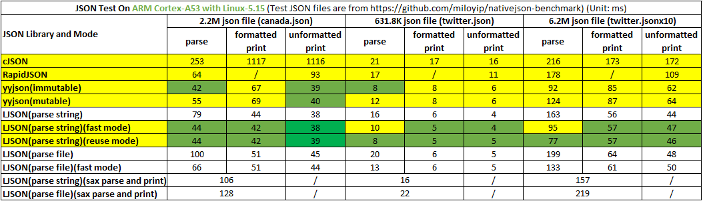

# LJSON Description

[中文版](./README_zh-cn.md)

[LJSON: The Versatile, High-Performance, Truly Streaming C Language JSON and Numerical Engine](./notes/introduction.md)

[LJSON's Balancing Act for High-Performance Optimization: Philosophical Thinking and Engineering Practice](./notes/optimization.md)

[yyjson ≠ The Universal Champion: It's Just a Specialized Instance of LJSON's DOM Reuse Mode](./notes/cmp_yyjson.md)

[A Method for Fast Division Within a Limited Domain](./notes/fastdiv.md)

## Overview

LJSON is a dual-mode data processing engine designed for extreme performance, serving both as a comprehensive JSON5-compliant processor and an industry-leading numerical string conversion library.

* Dual Core Capabilities:
    * Comprehensive JSON Processing: Full compliance with JSON5 specification, offering DOM/SAX dual parsing modes and file stream processing capabilities
    * Numerical Conversion Engine: Proprietary ldouble algorithm enabling bidirectional floating-point string conversion, outperforming traditional solutions

> Note: On the 64-bit operating system, from the version v5.0.0, the object byte size has been reduced from 40 bytes to 32 bytes, resulting in a 5% to 10% improvement in parsing speed. However, it is not compatible with the version v3.x.x series.

## Key Features

### LJSON Features

* Lightning-Fast JSON Processing:
    * Outperforms cJSON by significant margin
    * Surpasses RapidJSON by large margin
    * Slightly exceeds yyjson in parsing/printing performance
* Advanced Floating-Point Conversion:
    * Built-in ldouble algorithm demonstrates 10-70x speedup over standard libraries
    * 10%-100% faster than industry solutions
* Full JSON5 Support:
    * Modern JSON features including hexadecimal, comments, trailing commas (specific macros required in json.c for some features)
* Multi-Scenario Optimization:
    * Efficient memory management through DOM/SAX dual modes, memory pools, memory reuse, and file stream processing
    * True streaming implementation: Parses while reading files and prints while writing, unlike yyjson's pseudo-stream approach
* Memory optimization:
    * Direct reuse of raw data for key/string storage
    * Persistent memory reuse across multiple parse/print operations with zero heap allocations
    * SAX + streaming combination enables constant memory usage (KB-level for 1GB JSON files)
* Extended Data Type Support:
    * Long integers, hexadecimal numbers, and other extended types
    * **Binary data extension, it format is `<len:data>`**
* Developer-Friendly:
    * cJSON-inspired API design
    * Pure C implementation with no third-party dependencies
    * Supports multiple compilers and processor architectures

### LDOUBLE Algorithm Features

* String-to-Number Conversion: 1-10x faster than standard libraries
* Number-to-String Conversion:
    * Not fully comply with the IEEE-754 standard for best performance, only has 17-digits precision
    * Always outputs shortest precise representation
    * Performance benchmarks:
        * 1.5%-10% of sprintf's execution time (10-70x faster)
        * Generally outperforms grisu2 except for single-decimal cases, 100%+ faster in scientific notation
        * Typically exceeds dragonbox, 30%+ faster in scientific notation

### Compile Method

* Compile directly

```sh
gcc -o ljson json.c -jnum.c json_test.c -O2 -ffunction-sections -fdata-sections -W -Wall
```

* Compile with [IMAKE](https://github.com/lengjingzju/cbuild-ng)

```sh
make O=<output path> && make O=<output path> DESTDIR=<install path>
```

* Cross Compile

```sh
make O=<output path> CROSS_COMPILE=<tool prefix> && make O=<output path> DESTDIR=<install path>
```

* Choose double to string algorithm: `gcc -DJSON_DTOA_ALGORITHM=n` or `make DTOA=n`, n may be 0 / 1 / 2 / 3
    * 0: Personal implementation of ldouble algorithm
    * 1: C standard library sprintf
    * 2: Personal optimized grisu2 algorithm
    * 3: Personal optimized dragonbox algorithm
<br>

* Choose between a large lookup table or a small lookup table: `gcc -DUSING_SMALL_LUT=n` or `make SMALL=n`, n may be 0 / 1
    * 0: Large lookup table, it may be a little fast
    * 1: Small lookup table, it reduces the code segment size to approximately 5KB
<br>

* Windows MSC
    * Open `MSC\ljson\ljson.sln` with `Visual Studio 2022`

### Run Method

```sh
./ljson <json filename> <test index:0-7>
```

### Debug Method

* Set the value of the variable `JSON_ERROR_PRINT_ENABLE` in `json.c` to `1` and then re-compile

### Parse Config

* `#define JSON_PARSE_SKIP_COMMENT         1` : Whether to allow C-like single-line comments and multi-line comments(JSON5 feature)
* `#define JSON_PARSE_LAST_COMMA           1` : Whether to allow comma in last element of array or object(JSON5 feature)
* `#define JSON_PARSE_EMPTY_KEY            0` : Whether to allow empty key
* `#define JSON_PARSE_SPECIAL_CHAR         1` : Whether to allow special characters such as newline in the string(JSON5 feature)
* `#define JSON_PARSE_SPECIAL_QUOTES       1` : Whether to allow single quoted string/key and unquoted key(JSON5 feature)
* `#define JSON_PARSE_HEX_NUM              1` : Whether to allow HEX number(JSON5 feature)
* `#define JSON_PARSE_SPECIAL_NUM          1` :Whether to allow special number such as starting with '.', '+', '0', for example: `+99` `.1234` `10.` `001`(JSON5 feature)
* `#define JSON_PARSE_SPECIAL_DOUBLE       1` : Whether to allow special double such as `NaN`, `Infinity`, `-Infinity`(JSON5 feature)
* `#define JSON_PARSE_SINGLE_VALUE         1` : Whether to allow json starting with non-array and non-object
* `#define JSON_PARSE_FINISHED_CHAR        0` : Whether to allow characters other than spaces after finishing parsing

Note:
* It 100% matches the test cases of [nativejson-benchmark](https://github.com/miloyip/nativejson-benchmark) when only `JSON_PARSE_EMPTY_KEY` is set to 1, all others are set to 0.
* Setting `JSON_PARSE_SKIP_COMMENT` and `JSON_PARSE_SPECIAL_QUOTES` to 1 will significantly affect the parsing speed.

## Speed Test

### Test Code

Other json test codes are located in the benchmark directory. Just put the corresponding source file in the root directory of the corresponding json project.

```sh
gcc -o cjson cjson_test.c cJSON.c -O2               # cJSON
g++ -o rapidjson rapidjson_test.c -Iinclude -O2     # RapidJSON
gcc -o yyjson yyjson_test.c src/yyjson.c -Isrc -O2  # yyjson
gcc -o strdup strdup_test.c -O2                     # strdup和strlen
```

Test Script

```sh
#!/bin/bash

src=$1

if [ -z $src ] || [ ! -e $src ]; then
	echo "Usage: $0 <json file>"
	exit 1
fi

run_cmd() {
	printf "%-15s " $1
	eval $@
	sync
	sleep 0.1
}

for i in `seq 1 7`; do
	run_cmd ./ljson $src $i
done

run_cmd ./cjson $src
run_cmd ./rapidjson $src
run_cmd ./yyjson $src
run_cmd ./yyjson $src 1
run_cmd ./strdup $src
```

Test Mode

* ljson provides 7 test modes
    * 1: Normal DOM mode, use malloc to apply for memory, parse and print string
    * 2: Fast DOM mode, apply for large memory, then allocate memory from large memory (cannot free small memory alone), parse and print string
    * 3: Reuse DOM mode, apply for large memory, then allocate memory from large memory (cannot free small memory alone), and reuse the original parsed string for key and string value, parse and print string
    * 4: File DOM mode, no need to read the file before parsing or print before writing, use malloc to apply for memory, read file and parse json at the same time, and print json and write file at the same time
    * 5: Fast file DOM mode, no need to read the file before parsing or print before writing, apply for large memory, then allocate memory from large memory (cannot free small memory alone), read file and parse json at the same time, and print json and write file at the same time
    * 6: Normal SAX mode, parse and print string
    * 7: File SAX mode, no need to read the file before parsing, read file and parse json at the same time
* yyjson provides two test modes: unmutable and mutable

### Json Test Result

Note 1: 'O2' optimization level and default option compilation, the test files come from the [nativejson-benchmark](https://github.com/miloyip/nativejson-benchmark) project.

Note 2: Due to modifications such as feature additions and logic optimizations, the latest version may not necessarily conform to the test results below. For example, using more precise numerical processing reduces floating-point parsing performance (processing canada.json), and improving branch prediction in reuse mode (mode 3) improves parsing performance.

> Test Platform: ARM64 Development Board | CPU: ARM CortexA53 | OS: Linux-5.15<br>
> Test Result: LJSON parses 475% faster and prints 2836% faster than cJSON, LJSON parses 131% faster and prints 147% faster than RapidJSON (with file reading and writing)



> Test Platform: PC | CPU: Intel i7-10700 | OS: Ubuntu 18.04 (VirtualBox)<br>
> Test Result: LJSON parses 560% faster and prints 3184% faster than cJSON, LJSON parses 75% faster and prints 133% faster than RapidJSON
(with file reading and writing)


> Test Platform: PC | CPU: Intel i7-1260P | OS: Ubuntu 20.04 (VMWare) | LJSON_v5.0.0<br>
> Test Result: LJSON parses 408% faster and prints 1908% faster than cJSON, LJSON parses 118% faster and prints 188% faster than RapidJSON
(without file reading and writing)


### String-Number Test Result

**Test Method**

```sh
make O=obj
./benchmark/benchmark.sh obj
./benchmark/benchmark.sh obj atod
```

> Test Platform: PC | CPU: Intel i7-1260P | OS: Ubuntu 20.04 (VMWare)<br>
> Test Platform: PC | CPU: Intel i7-1260P | OS: Windows11 (MSVC 2023)<br>
> Test Command(dtoa): `./jnum_test <num> 10000000` # Test ten million times<br>
> Test Command(atod): `./jnum_test a <num> 10000000` # Test ten million times<br>
> Test Result(dtoa): ldouble is an order of magnitude faster than sprintf (40 times faster in some cases), and slightly faster than grisu2 and dragonbox; ldouble can guarantee the shortest output within the precision range, which is consistent with printf output.<br>
> Test Result(atod): ldouble is 2x~3x faster than strtod in most cases (some use cases can be up to 10 times faster).


## APIs

Refer to `json.h` and `jnum.h`.

## Zero-Heap-Allocation Mode

For parsing and printing small JSON files, the zero-heap-allocation mode is recommended. The LJSON library only allocates memory during the first processing, and subsequent operations may not perform any heap memory allocation internally.

* The parsed JSON objects persistently reuse the memory pool `mem`.
* String values are stored by reusing the original string (i.e., the original string will be modified and must not be freed while the JSON is in use).
* To retrieve objects under `JSON_ARRAY`/`JSON_OBJECT`, use `json_get_items` for acceleration. The memory of these objects can be persistently reused (each level requires a separate `json_items_t`).
* Printing persistently reuses the member `p` of `json_print_ptr_t`.

```c
size_t len = 0;

// Initialization (performed only once for parsing)
json_mem_t mem;
pjson_memory_init(&mem);
/* obj_mgr needs to be set to a suitable value so that one memory block can store all objects.
   If the original string is not reused, the other two mgrs also need to be set */
mem.valid = true;
mem.obj_mgr.mem_size = max_data_size;

// Accelerated parsing by reusing items
json_items_t items;
memset(&items, 0, sizeof(items));

// Initialization (performed only once for printing)
json_print_ptr_t ptr = {PRINT_BUF_LEN, 0};

// Business loop
while (1) {
    /* ---- Parse incoming JSON message ---- */
    json_object *json = json_reuse_parse_str(buf, &len, &mem);
        // Get all data under a JSON_ARRAY
        if (json_get_items(array, &items) < 0)
            return -1;
        for (size_t i = 0; i < items.count; ++i) {
            ids.push_back(json_get_lint_value(items.items[i].json));
        }

    /* ----- Business logic processing ---- */

    /* ---- Print outgoing JSON message ---- */
    json_sax_print_hd hd = json_sax_print_unformat_start(100, &ptr); // Start printing (reuse ptr)
    json_sax_print_object(hd, NULL, JSON_SAX_START); // Top-level left brace
        // Print data under an JSON_OBJECT
        json_sax_print_string(hd, &key, sval);
        // Print all data under an JSON_ARRAY
        json_sax_print_array(hd, &key, JSON_SAX_START);
        for (const auto &v : ids) {
            json_sax_print_lint(hd, NULL, v);
        }
        json_sax_print_array(hd, NULL, JSON_SAX_FINISH);
    ret |= json_sax_print_object(hd, NULL, JSON_SAX_FINISH); // Top-level right brace
    json_sax_print_finish(hd, len, &ptr) // Finish printing; the generated string is in ptr.p or the return value

    /* ---- JSON memory pool handling ---- */
    // No longer need the json structure; retain only the first linked list node
    pjson_memory_refresh(&mem);
}

// Resource cleanup (performed only once for parsing)
json_free_items(&items);
pjson_memory_free(&mem);

// Resource cleanup (performed only once for printing)
json_memory_free(ptr.p);
```

## Contact

* Phone: +86 18368887550
* wx/qq: 1083936981
* Email: lengjingzju@163.com 3090101217@zju.edu.cn
