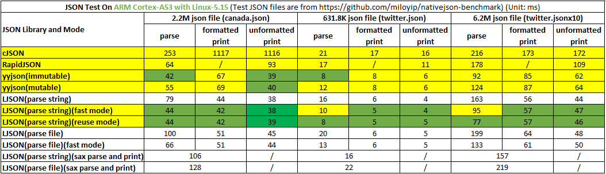
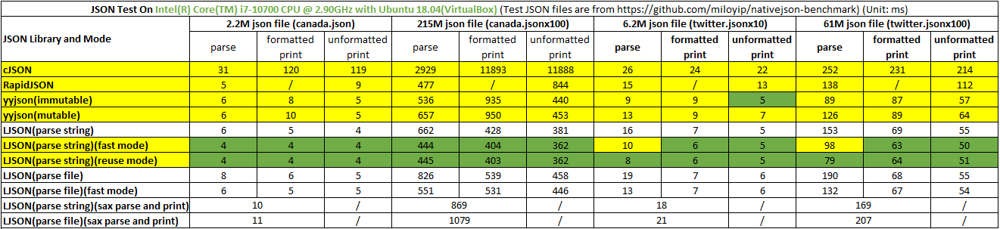
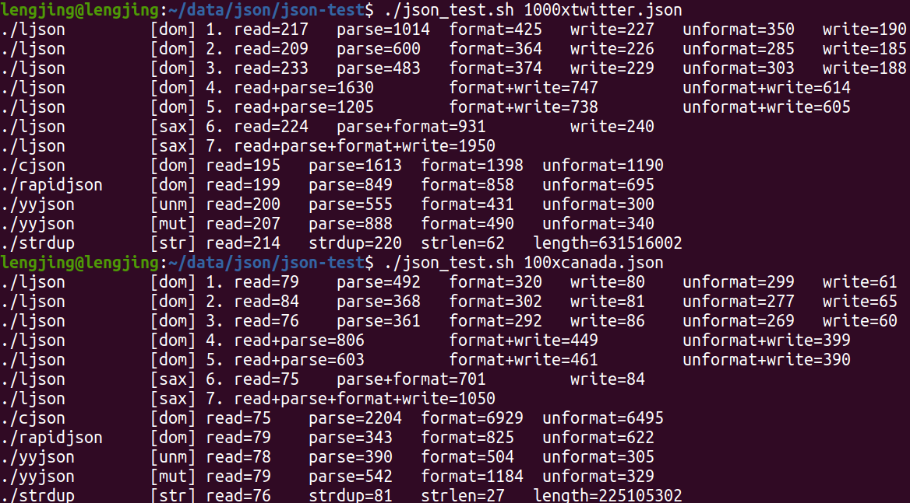
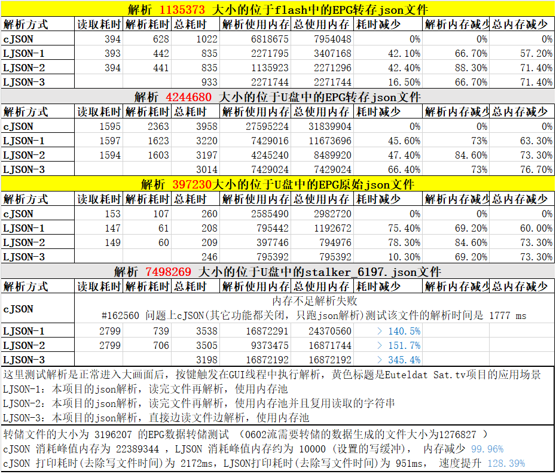

# LJSON 说明

[English Edition](./README.md)

LJSON 是一个远远快于 cJSON、大幅度快于 RapidJSON 的 C 实现的 JSON 库，他是目前最快的通用 JSON 库，也支持JSON5的全部特性。

LJSON 支持 JSON 的解析、打印、编辑，提供 DOM 和 SAX 接口，I/O 支持字符串和文件，且完全支持 nativejson-benchmark 的测试用例。

LJSON 默认使用个人开发的 ldouble 算法打印浮点数，和标准库对比可能只有第15位或16位小数的区别，是目前最快的浮点数转字符串算法；也可选择个人优化过的 grisu2 算法或 dragonbox 算法。

ldouble算法比sprintf快一个数量级(某些值快40倍)，也比grisu(谷歌实现，浏览器V8引擎使用)和dragonbox(高性能计算库Boost、Eigen等使用)快一些(某些值比grisu2快100%，比dragonbox快60%)；ldouble算法在精度范围内可以保证最短，和sprintf输出一致，而grisu和dragonbox无法做到这点。

## 功能特点

* 更快：打印和解析速度比 cJSON 和 RapidJSON 都要快，速度最高可比 CJSON 快32倍，比 Rapid JSON 快1.5倍，见测试结果
* 更省：提供多种省内存的手段，例如内存池、文件边读边解析、边打印边写文件、SAX方式的接口，可做到内存占用是个常数
* 更强：支持DOM和SAX风格的API，提供普通模式和内存池模式JSON的接口，支持字符串和文件作为输入输出(可扩展支持其它流)，扩展支持长长整形和十六进制数字
* 更友好：C语言实现，不依赖任何库，不含平台相关代码，只有一个头文件和库文件，和cJSON对应一致的接口，代码逻辑比任何JSON库都更清晰
* JSON5：支持全部JSON5特性，例如十六进制数字、注释、数组和对象的尾元素逗号、字符串值可以使用单引号，键值可以使用单引号或无引号等
* 缓冲：如果多次解析打印JSON，可以复用已分配的内存，库内部基本不进行任何的堆内存申请；可以将某个集合类型下的所有子对象保存为数据，并使用hash和二分法加快查找

## 编译运行

### 编译方法

* 直接编译

```sh
gcc -o ljson json.c jnum.c json_test.c -lm -O2 -ffunction-sections -fdata-sections -W -Wall
```

* [IMAKE](https://github.com/lengjingzju/cbuild-ng) 编译

```sh
make O=<编译输出目录> && make O=<编译输出目录> DESTDIR=<安装目录>
```

* 交叉编译

```sh
make O=<编译输出目录> CROSS_COMPILE=<交叉编译器前缀> && make O=<编译输出目录> DESTDIR=<安装目录>
```

* 选择浮点数转字符串算法 `gcc -DJSON_DTOA_ALGORITHM=n`， n可能为 0 / 1 / 2 / 3
    * 0: 个人实现的 ldouble 算法: 比谷歌的 grisu2 的默认实现快 **129%** ，比腾讯优化的 grisu2 实现快 **33%** ，比 sprintf 快 **14.6** 倍
    * 1: C标准库的 sprintf
    * 2: 个人优化的 grisu2 算法: 谷歌的 grisu2 的默认实现比 sprintf 快 **5.7** 倍，腾讯优化的 grisu2 实现比 sprintf 快 **9.1** 倍，LJSON 的优化实现比 sprintf 快 **11.4** 倍
    * 3: 个人优化的 dragonbox 算法: 性能和 ldouble 算法差，比 grisu2 算法强

### 运行方法

```sh
./ljson <json文件名> <测试序号0-7>
```

### 调试方法

* 设置 json.c 中的变量 `JSON_ERROR_PRINT_ENABLE` 的值为 `1` 后重新编译

### 解析配置

* `#define JSON_PARSE_SKIP_COMMENT         1` : 是否允许类似C语言的单行注释和多行注释(JSON5特性)
* `#define JSON_PARSE_LAST_COMMA           1` : 是否允许JSON_ARRAY或JSON_OBJECT的最后一个元素的末尾有逗号(JSON5特性)
* `#define JSON_PARSE_EMPTY_KEY            0` : 是否允许键为空字符串
* `#define JSON_PARSE_SPECIAL_CHAR         1` : 是否允许字符串中有特殊的字符，例如换行符(JSON5特性)
* `#define JSON_PARSE_SPECIAL_QUOTES       1` : 是否允许字符串值可以使用单引号，键值可以使用单引号或无引号(JSON5特性)
* `#define JSON_PARSE_HEX_NUM              1` : 是否允许十六进制的解析(JSON5特性)
* `#define JSON_PARSE_SPECIAL_NUM          1` : 是否允许特殊的数字，例如前导0，加号，无整数的浮点数等，例如 `+99` `.1234` `10.` `001` 等(JSON5特性)
* `#define JSON_PARSE_SPECIAL_DOUBLE       1` : 是否允许特殊的double值 `NaN` `Infinity` `-Infinity`(JSON5特性)
* `#define JSON_PARSE_SINGLE_VALUE         1` : 是否允许不是JSON_ARRAY或JSON_OBJECT开头的JSON值
* `#define JSON_PARSE_FINISHED_CHAR        0` : 是否解析完成后忽略检查字符串尾部的合法性

注：

* 如果需要100%符合 [nativejson-benchmark](https://github.com/miloyip/nativejson-benchmark)，需要将 `JSON_PARSE_EMPTY_KEY` 置为1，其它值全部置为0。
* `JSON_PARSE_SKIP_COMMENT` 和 `JSON_PARSE_SPECIAL_QUOTES` 置为1时会显著影响解析速度。

## 性能测试

### 测试代码

其它json的测试代码位于benchmark目录，将对应的文件放在对应json工程的根目录即可

```sh
gcc -o cjson cjson_test.c cJSON.c -O2               # cJSON
g++ -o rapidjson rapidjson_test.c -Iinclude -O2     # RapidJSON
gcc -o yyjson yyjson_test.c src/yyjson.c -Isrc -O2  # yyjson
gcc -o strdup strdup_test.c -O2                     # strdup和strlen
```

测试脚本

```sh
#!/bin/bash

src=$1

if [ -z $src ] || [ ! -e $src ]; then
	echo "Usage: $0 <json file>"
	exit 1
fi

run_cmd() {
	printf "%-15s " $1
	eval $@
	sync
	sleep 0.1
}

for i in `seq 1 7`; do
	run_cmd ./ljson $src $i
done

run_cmd ./cjson $src
run_cmd ./rapidjson $src
run_cmd ./yyjson $src
run_cmd ./yyjson $src 1
run_cmd ./strdup $src
```

测试模式

* ljson提供7种测试模式
    * 1: 普通DOM模式，使用malloc申请内存，解析和打印都为字符串
    * 2: 快速DOM模式，申请大内存，然后内存从大内存分配(无法单独释放小内存)，解析和打印都为字符串
    * 3: 重用DOM模式，申请大内存，然后内存从大内存分配(无法单独释放小内存)，且键和字符串值重用原始解析字符串，解析和打印都为字符串
    * 4: 文件DOM模式，无需读完文件再解析或打印完再写入，使用malloc申请内存，边读文件边解析，边打印边写入文件
    * 5: 快速文件DOM模式，无需读完文件再解析或打印完再写入，申请大内存，然后内存从大内存分配(无法单独释放小内存)，边读文件边解析，边打印边写入文件
    * 6: 普通SAX模式，解析和打印都为字符串
    * 7: 文件SAX模式，无需读完文件再解析，边读文件边解析
* yyjson提供两种测试模式：unmutable 和 mutable 模式

### JSON测试结果

注：主要是测试速度，`O2` 优化等级且默认选项编译，测试文件来自 [nativejson-benchmark](https://github.com/miloyip/nativejson-benchmark) 项目

> 测试平台: ARM64开发板 | CPU: ARM CortexA53 | OS: Linux-5.15<br>
> 测试结果: LJSON 比cJSON 解析最快可达 475%，打印最快可达 2836%，LJSON 比 RapidJSON 解析最快可达 131%，打印最快可达 147% (耗时含文件读写时间)



> 测试平台: PC | CPU: Intel i7-10700 | OS: Ubuntu 18.04 (VirtualBox)<br>
> 测试结果: LJSON 比cJSON 解析最快可达 560%，打印最快可达 3184%，LJSON 比 RapidJSON 解析最快可达 75%，打印最快可达 133% (耗时含文件读写时间)




> 测试平台: PC | CPU: Intel i7-1260P | OS: Ubuntu 20.04 (VMWare)<br>
> 测试结果: LJSON 比cJSON 解析最快可达 510%，打印最快可达 2273%，LJSON 比 RapidJSON 解析最快可达 76%，打印最快可达 144% (耗时不含文件读写时间)



> 测试平台: Nationalchip STB | CPU: CSKY | DDR3: 128MB, 533MHz | OS: ECOS<br>
> 注: 老版本测试结果，新版本删除了临时buffer，且解析速度提升了两倍



### 浮点数转字符串算法测试结果

> 测试平台: PC | CPU: Intel i7-1260P | OS: Ubuntu 20.04 (VMWare)<br>
> 测试命令: `./jnum_test <num> 10000000` # 测试千万次
> 测试结果: ldouble比sprintf快一个数量级(某些用例可快40倍)，也比grisu2和dragonbox快一些；ldouble在精度范围内可以保证最短，和printf输出一致，而grisu和dragonbox无法做到这点

注：三个值分别是输出字符串、千万次运行耗时、对比sprintf的速度提升百分比。

| 输入 | sprintf | ldouble | grisu2 | dragonbox |
| :--- | :------ | :------ | :----- | :-------- |
| `0.1` | `0.1` `1266ms` | `0.1` `77ms` `1644%` | `0.1` `75ms` `1688%` | `0.1` `87ms` `1455%` |
| `0.2` | `0.2` `1205ms` | `0.2` `76ms` `1586%` | `0.2` `75ms` `1607%` | `0.2` `89ms` `1354%` |
| `0.3` | `0.3` `1233ms` | `0.3` `79ms` `1561%` | `0.30000000000000007` `196ms` `629%` | `0.30000000000000004` `88ms` `1401%` |
| `0.4` | `0.4` `1254ms` | `0.4` `78ms` `1608%` | `0.4` `81ms` `1548%` | `0.4` `89ms` `1409%` |
| `0.5` | `0.5` `1259ms` | `0.5` `78ms` `1614%` | `0.5` `77ms` `1635%` | `0.5` `84ms` `1499%` |
| `0.6` | `0.6` `1237ms` | `0.6` `75ms` `1649%` | `0.6000000000000001` `196ms` `631%` | `0.6000000000000001` `107ms` `1156%` |
| `0.7` | `0.7` `1245ms` | `0.7` `80ms` `1556%` | `0.7000000000000001` `189ms` `659%` | `0.7000000000000001` `111ms` `1122%` |
| `0.8` | `0.8` `1256ms` | `0.8` `84ms` `1495%` | `0.8` `79ms` `1590%` | `0.8` `86ms` `1460%` |
| `0.9` | `0.9` `1231ms` | `0.9` `81ms` `1520%` | `0.9` `80ms` `1539%` | `0.9` `88ms` `1399%` |

| 输入 | sprintf | ldouble | grisu2 | dragonbox |
| :--- | :------ | :------ | :----- | :-------- |
| `1.1` | `1.1` `1084ms` | `1.1` `88ms` `1232%` | `1.1` `94ms` `1153%` | `1.1` `92ms` `1178%` |
| `2.2` | `2.2` `1108ms` | `2.2` `87ms` `1274%` | `2.2` `95ms` `1166%` | `2.2` `99ms` `1119%` |
| `3.3` | `3.3` `1178ms` | `3.3` `88ms` `1339%` | `3.3` `92ms` `1280%` | `3.3` `95ms` `1240%` |
| `4.4` | `4.4` `1121ms` | `4.4` `86ms` `1303%` | `4.4` `90ms` `1246%` | `4.4` `95ms` `1180%` |
| `5.5` | `5.5` `1133ms` | `5.5` `83ms` `1365%` | `5.5` `96ms` `1180%` | `5.5` `96ms` `1180%` |
| `6.6` | `6.6` `1173ms` | `6.6` `93ms` `1261%` | `6.6` `113ms` `1038%` | `6.6` `102ms` `1150%` |
| `7.7` | `7.7` `1138ms` | `7.7` `83ms` `1371%` | `7.7` `97ms` `1173%` | `7.7` `100ms` `1138%` |
| `8.8` | `8.8` `1282ms` | `8.8` `83ms` `1545%` | `8.8` `93ms` `1378%` | `8.8` `103ms` `1245%` |
| `9.9` | `9.9` `1275ms` | `9.9` `92ms` `1386%` | `9.9` `93ms` `1371%` | `9.9` `94ms` `1356%` |

| 输入 | sprintf | ldouble | grisu2 | dragonbox |
| :--- | :------ | :------ | :----- | :-------- |
| `0.1` | `0.1` `1352ms` | `0.1` `87ms` `1554%` | `0.1` `81ms` `1669%` | `0.1` `94ms` `1438%` |
| `0.12` | `0.12` `1407ms` | `0.12` `81ms` `1737%` | `0.12` `97ms` `1451%` | `0.12` `92ms` `1529%` |
| `0.123` | `0.123` `1469ms` | `0.123` `97ms` `1514%` | `0.123` `132ms` `1113%` | `0.123` `114ms` `1289%` |
| `0.1234` | `0.1234` `1410ms` | `0.1234` `89ms` `1584%` | `0.12340000000000001` `210ms` `671%` | `0.12340000000000001` `122ms` `1156%` |
| `0.12345` | `0.12345` `1410ms` | `0.12345` `97ms` `1454%` | `0.12345` `134ms` `1052%` | `0.12345` `111ms` `1270%` |
| `0.123456` | `0.123456` `1442ms` | `0.123456` `100ms` `1442%` | `0.123456` `146ms` `988%` | `0.123456` `109ms` `1323%` |
| `0.1234567` | `0.1234567` `1468ms` | `0.1234567` `102ms` `1439%` | `0.12345669999999999` `216ms` `680%` | `0.12345669999999999` `141ms` `1041%` |
| `0.12345678` | `0.12345678` `1419ms` | `0.12345678` `104ms` `1364%` | `0.12345678` `168ms` `845%` | `0.12345678` `120ms` `1182%` |
| `0.123456789` | `0.123456789` `1423ms` | `0.123456789` `116ms` `1227%` | `0.12345678900000001` `212ms` `671%` | `0.12345678900000001` `124ms` `1148%` |
| `0.12345678901` | `0.12345678901` `1491ms` | `0.12345678901` `116ms` `1285%` | `0.12345678901` `169ms` `882%` | `0.12345678901` `120ms` `1242%` |
| `0.123456789012` | `0.123456789012` `1440ms` | `0.123456789012` `113ms` `1274%` | `0.123456789012` `182ms` `791%` | `0.123456789012` `121ms` `1190%` |
| `0.1234567890123` | `0.1234567890123` `1425ms` | `0.1234567890123` `120ms` `1188%` | `0.1234567890123` `186ms` `766%` | `0.1234567890123` `133ms` `1071%` |
| `0.12345678901234` | `0.12345678901234` `1421ms` | `0.12345678901234` `122ms` `1165%` | `0.12345678901234` `196ms` `725%` | `0.12345678901234` `123ms` `1155%` |
| `0.123456789012345` | `0.123456789012345` `1429ms` | `0.123456789012345` `117ms` `1221%` | `0.12345678901234501` `216ms` `662%` | `0.12345678901234501` `137ms` `1043%` |
| `0.1234567890123456` | `0.123456789012346` `1425ms` | `0.1234567890123455` `122ms` `1168%` | `0.1234567890123456` `208ms` `685%` | `0.1234567890123456` `131ms` `1088%` |

| 输入 | sprintf | ldouble | grisu2 | dragonbox |
| :--- | :------ | :------ | :----- | :-------- |
| `0.1e100` | `1e+99` `2461ms` | `1e+99` `71ms` `3466%` | `1.0000000000000001e+99` `250ms` `984%` | `1.0000000000000001e+99` `101ms` `2437%` |
| `0.12e100` | `1.2e+99` `2785ms` | `1.2e+99` `85ms` `3276%` | `1.2e+99` `98ms` `2842%` | `1.2e+99` `103ms` `2704%` |
| `0.123e100` | `1.23e+99` `3473ms` | `1.23e+99` `84ms` `4135%` | `1.23e+99` `111ms` `3129%` | `1.23e+99` `118ms` `2943%` |
| `0.1234e100` | `1.234e+99` `2804ms` | `1.234e+99` `83ms` `3378%` | `1.2340000000000002e+99` `254ms` `1104%` | `1.2340000000000002e+99` `119ms` `2356%` |
| `0.12345e100` | `1.2345e+99` `2875ms` | `1.2345e+99` `89ms` `3230%` | `1.2345000000000002e+99` `245ms` `1173%` | `1.2345000000000002e+99` `121ms` `2376%` |
| `0.123456e100` | `1.23456e+99` `2967ms` | `1.23456e+99` `89ms` `3334%` | `1.23456e+99` `172ms` `1725%` | `1.23456e+99` `120ms` `2472%` |
| `0.1234567e100` | `1.234567e+99` `3534ms` | `1.234567e+99` `87ms` `4062%` | `1.2345669999999998e+99` `257ms` `1375%` | `1.2345669999999998e+99` `139ms` `2542%` |
| `0.12345678e100` | `1.2345678e+99` `3459ms` | `1.2345678e+99` `89ms` `3887%` | `1.2345678e+99` `206ms` `1679%` | `1.2345678e+99` `118ms` `2931%` |
| `0.123456789e100` | `1.23456789e+99` `3192ms` | `1.23456789e+99` `108ms` `2956%` | `1.23456789e+99` `211ms` `1513%` | `1.23456789e+99` `130ms` `2455%` |
| `0.12345678901e100` | `1.2345678901e+99` `3380ms` | `1.2345678901e+99` `100ms` `3380%` | `1.2345678901e+99` `222ms` `1523%` | `1.2345678901e+99` `137ms` `2467%` |
| `0.123456789012e100` | `1.23456789012e+99` `3497ms` | `1.23456789012e+99` `106ms` `3299%` | `1.23456789012e+99` `230ms` `1520%` | `1.23456789012e+99` `126ms` `2775%` |
| `0.1234567890123e100` | `1.234567890123e+99` `3600ms` | `1.234567890123e+99` `113ms` `3186%` | `1.2345678901230002e+99` `257ms` `1401%` | `1.2345678901230002e+99` `139ms` `2590%` |
| `0.12345678901234e100` | `1.2345678901234e+99` `3471ms` | `1.2345678901234e+99` `107ms` `3244%` | `1.2345678901234001e+99` `250ms` `1388%` | `1.2345678901234001e+99` `143ms` `2427%` |
| `0.123456789012345e100` | `1.23456789012345e+99` `3568ms` | `1.23456789012345e+99` `108ms` `3304%` | `1.2345678901234502e+99` `247ms` `1445%` | `1.2345678901234502e+99` `144ms` `2478%` |
| `0.1234567890123456e100` | `1.23456789012346e+99` `3653ms` | `1.234567890123455e+99` `109ms` `3351%` | `1.234567890123456e+99` `250ms` `1461%` | `1.234567890123456e+99` `139ms` `2628%` |

| 输入 | sprintf | ldouble | grisu2 | dragonbox |
| :--- | :------ | :------ | :----- | :-------- |
| `0.1e-100` | `1e-101` `2007ms` | `1e-101` `77ms` `2606%` | `1e-101` `86ms` `2334%` | `1e-101` `87ms` `2307%` |
| `0.12e-100` | `1.2e-101` `2082ms` | `1.2e-101` `89ms` `2339%` | `1.2e-101` `108ms` `1928%` | `1.2e-101` `100ms` `2082%` |
| `0.123e-100` | `1.23e-101` `2025ms` | `1.23e-101` `92ms` `2201%` | `1.23e-101` `133ms` `1523%` | `1.23e-101` `108ms` `1875%` |
| `0.1234e-100` | `1.234e-101` `2021ms` | `1.234e-101` `86ms` `2350%` | `1.2340000000000002e-101` `255ms` `793%` | `1.2340000000000002e-101` `122ms` `1657%` |
| `0.12345e-100` | `1.2345e-101` `2079ms` | `1.2345e-101` `99ms` `2100%` | `1.2345e-101` `178ms` `1168%` | `1.2345e-101` `116ms` `1792%` |
| `0.123456e-100` | `1.23456e-101` `2092ms` | `1.23456e-101` `94ms` `2226%` | `1.23456e-101` `187ms` `1119%` | `1.23456e-101` `118ms` `1773%` |
| `0.1234567e-100` | `1.234567e-101` `2136ms` | `1.234567e-101` `98ms` `2180%` | `1.2345669999999999e-101` `253ms` `844%` | `1.2345669999999999e-101` `141ms` `1515%` |
| `0.12345678e-100` | `1.2345678e-101` `2130ms` | `1.2345678e-101` `97ms` `2196%` | `1.2345678e-101` `222ms` `959%` | `1.2345678e-101` `119ms` `1790%` |
| `0.123456789e-100` | `1.23456789e-101` `2111ms` | `1.23456789e-101` `108ms` `1955%` | `1.2345678900000001e-101` `256ms` `825%` | `1.2345678900000001e-101` `136ms` `1552%` |
| `0.12345678901e-100` | `1.2345678901e-101` `2121ms` | `1.2345678901e-101` `106ms` `2001%` | `1.2345678901e-101` `234ms` `906%` | `1.2345678901e-101` `128ms` `1657%` |
| `0.123456789012e-100` | `1.23456789012e-101` `2088ms` | `1.23456789012e-101` `105ms` `1989%` | `1.23456789012e-101` `248ms` `842%` | `1.23456789012e-101` `123ms` `1698%` |
| `0.1234567890123e-100` | `1.234567890123e-101` `2106ms` | `1.234567890123e-101` `114ms` `1847%` | `1.234567890123e-101` `239ms` `881%` | `1.234567890123e-101` `133ms` `1583%` |
| `0.12345678901234e-100` | `1.2345678901234e-101` `2070ms` | `1.2345678901234e-101` `121ms` `1711%` | `1.2345678901234001e-101` `279ms` `742%` | `1.2345678901234001e-101` `257ms` `805%` |
| `0.123456789012345e-100` | `1.23456789012345e-101` `2041ms` | `1.23456789012345e-101` `111ms` `1839%` | `1.2345678901234502e-101` `263ms` `776%` | `1.2345678901234502e-101` `146ms` `1398%` |
| `0.1234567890123456e-100` | `1.23456789012346e-101` `2041ms` | `1.234567890123455e-101` `116ms` `1759%` | `1.2345678901234559e-101` `263ms` `776%` | `1.2345678901234559e-101` `143ms` `1427%` |

| 输入 | sprintf | ldouble | grisu2 | dragonbox |
| :--- | :------ | :------ | :----- | :-------- |
| `1e1` | `10` `879ms` | `10.0` `27ms` `3256%` | `10.0` `70ms` `1256%` | `10.0` `32ms` `2747%` |
| `1e2` | `100` `1033ms` | `100.0` `28ms` `3689%` | `100.0` `72ms` `1435%` | `100.0` `35ms` `2951%` |
| `1e3` | `1000` `1232ms` | `1000.0` `29ms` `4248%` | `1000.0` `73ms` `1688%` | `1000.0` `36ms` `3422%` |
| `1e4` | `10000` `1206ms` | `10000.0` `31ms` `3890%` | `10000.0` `79ms` `1527%` | `10000.0` `36ms` `3350%` |
| `1e5` | `100000` `1387ms` | `100000.0` `32ms` `4334%` | `100000.0` `77ms` `1801%` | `100000.0` `36ms` `3853%` |
| `1e6` | `1000000` `1360ms` | `1000000.0` `34ms` `4000%` | `1000000.0` `68ms` `2000%` | `1000000.0` `39ms` `3487%` |
| `1e7` | `10000000` `1391ms` | `10000000.0` `35ms` `3974%` | `10000000.0` `73ms` `1905%` | `10000000.0` `42ms` `3312%` |
| `1e8` | `100000000` `1465ms` | `100000000.0` `33ms` `4439%` | `100000000.0` `223ms` `657%` | `100000000.0` `55ms` `2664%` |
| `1e9` | `1000000000` `1536ms` | `1000000000.0` `36ms` `4267%` | `1000000000.0` `225ms` `683%` | `1000000000.0` `41ms` `3746%` |
| `1e10` | `10000000000` `1561ms` | `10000000000.0` `41ms` `3807%` | `10000000000.0` `225ms` `694%` | `10000000000.0` `40ms` `3902%` |
| `1e11` | `100000000000` `1664ms` | `100000000000.0` `38ms` `4379%` | `100000000000.0` `233ms` `714%` | `100000000000.0` `41ms` `4059%` |
| `1e12` | `1000000000000` `1758ms` | `1000000000000.0` `35ms` `5023%` | `1000000000000.0` `241ms` `729%` | `1000000000000.0` `43ms` `4088%` |
| `1e13` | `10000000000000` `1790ms` | `10000000000000.0` `35ms` `5114%` | `10000000000000.0` `246ms` `728%` | `10000000000000.0` `41ms` `4366%` |
| `1e14` | `100000000000000` `1883ms` | `100000000000000.0` `40ms` `4708%` | `100000000000000.0` `231ms` `815%` | `100000000000000.0` `45ms` `4184%` |
| `1e15` | `1e+15` `1068ms` | `1000000000000000.0` `43ms` `2484%` | `1000000000000000.0` `164ms` `651%` | `1000000000000000.0` `47ms` `2272%` |
| `1e16` | `1e+16` `1071ms` | `10000000000000000.0` `94ms` `1139%` | `10000000000000000.0` `163ms` `657%` | `10000000000000000.0` `88ms` `1217%` |

| 输入 | sprintf | ldouble | grisu2 | dragonbox |
| :--- | :------ | :------ | :----- | :-------- |
| `1e-1` | `0.1` `1384ms` | `0.1` `83ms` `1667%` | `0.1` `82ms` `1688%` | `0.1` `98ms` `1412%` |
| `1e-2` | `0.01` `1464ms` | `0.01` `86ms` `1702%` | `0.01` `86ms` `1702%` | `0.01` `101ms` `1450%` |
| `1e-3` | `0.001` `1557ms` | `0.001` `81ms` `1922%` | `0.001` `95ms` `1639%` | `0.001` `101ms` `1542%` |
| `1e-4` | `0.0001` `1471ms` | `0.0001` `83ms` `1772%` | `0.0001` `92ms` `1599%` | `0.0001` `98ms` `1501%` |
| `1e-5` | `1e-05` `1434ms` | `0.00001` `81ms` `1770%` | `0.00001` `93ms` `1542%` | `0.00001` `99ms` `1448%` |
| `1e-6` | `1e-06` `1657ms` | `0.000001` `84ms` `1973%` | `0.000001` `96ms` `1726%` | `0.000001` `97ms` `1708%` |
| `1e-7` | `1e-07` `1537ms` | `0.0000001` `91ms` `1689%` | `1e-7` `68ms` `2260%` | `0.0000001` `100ms` `1537%` |
| `1e-8` | `1e-08` `1408ms` | `1e-8` `76ms` `1853%` | `1e-8` `67ms` `2101%` | `1e-8` `85ms` `1656%` |
| `1e-9` | `1e-09` `1533ms` | `1e-9` `78ms` `1965%` | `1e-9` `67ms` `2288%` | `1e-9` `86ms` `1783%` |
| `1e-10` | `1e-10` `1505ms` | `1e-10` `75ms` `2007%` | `1e-10` `78ms` `1929%` | `1e-10` `87ms` `1730%` |
| `1e-11` | `1e-11` `1613ms` | `1e-11` `79ms` `2042%` | `1e-11` `85ms` `1898%` | `1e-11` `85ms` `1898%` |
| `1e-12` | `1e-12` `1649ms` | `1e-12` `76ms` `2170%` | `1e-12` `84ms` `1963%` | `1e-12` `88ms` `1874%` |
| `1e-13` | `1e-13` `1598ms` | `1e-13` `75ms` `2131%` | `1e-13` `78ms` `2049%` | `1e-13` `89ms` `1796%` |
| `1e-14` | `1e-14` `1701ms` | `1e-14` `79ms` `2153%` | `1e-14` `77ms` `2209%` | `1e-14` `90ms` `1890%` |
| `1e-15` | `1e-15` `1637ms` | `1e-15` `77ms` `2126%` | `1e-15` `76ms` `2154%` | `1e-15` `84ms` `1949%` |
| `1e-16` | `1e-16` `1551ms` | `1e-16` `79ms` `1963%` | `1e-16` `71ms` `2185%` | `1e-16` `89ms` `1743%` |

| 输入 | sprintf | ldouble | grisu2 | dragonbox |
| :--- | :------ | :------ | :----- | :-------- |
| `0.9` | `0.9` `1358ms` | `0.9` `86ms` `1579%` | `0.9` `84ms` `1617%` | `0.9` `97ms` `1400%` |
| `0.99` | `0.99` `1464ms` | `0.99` `83ms` `1764%` | `0.99` `100ms` `1464%` | `0.99` `107ms` `1368%` |
| `0.999` | `0.999` `1456ms` | `0.999` `92ms` `1583%` | `0.999` `126ms` `1156%` | `0.999` `101ms` `1442%` |
| `0.9999` | `0.9999` `1390ms` | `0.9999` `96ms` `1448%` | `0.9999` `142ms` `979%` | `0.9999` `111ms` `1252%` |
| `0.99999` | `0.99999` `1362ms` | `0.99999` `104ms` `1310%` | `0.99999` `141ms` `966%` | `0.99999` `110ms` `1238%` |
| `0.999999` | `0.999999` `1407ms` | `0.999999` `104ms` `1353%` | `0.999999` `137ms` `1027%` | `0.999999` `107ms` `1315%` |
| `0.9999999` | `0.9999999` `1384ms` | `0.9999999` `104ms` `1331%` | `0.9999998999999999` `210ms` `659%` | `0.9999998999999999` `138ms` `1003%` |
| `0.99999999` | `0.99999999` `1353ms` | `0.99999999` `101ms` `1340%` | `0.9999999900000001` `206ms` `657%` | `0.9999999900000001` `129ms` `1049%` |
| `0.999999999` | `0.999999999` `1403ms` | `0.999999999` `113ms` `1242%` | `0.999999999` `168ms` `835%` | `0.999999999` `123ms` `1141%` |
| `0.9999999999` | `0.9999999999` `1413ms` | `0.9999999999` `116ms` `1218%` | `0.9999999999` `162ms` `872%` | `0.9999999999` `120ms` `1178%` |
| `0.99999999999` | `0.99999999999` `1392ms` | `0.99999999999` `115ms` `1210%` | `0.9999999999899999` `216ms` `644%` | `0.9999999999899999` `135ms` `1031%` |
| `0.999999999999` | `0.999999999999` `1362ms` | `0.999999999999` `123ms` `1107%` | `0.999999999999` `188ms` `724%` | `0.999999999999` `133ms` `1024%` |
| `0.9999999999999` | `0.9999999999999` `1378ms` | `0.9999999999999` `127ms` `1085%` | `0.9999999999999001` `209ms` `659%` | `0.9999999999999001` `134ms` `1028%` |
| `0.99999999999999` | `0.99999999999999` `1364ms` | `0.99999999999999` `122ms` `1118%` | `0.99999999999999` `193ms` `707%` | `0.99999999999999` `127ms` `1074%` |
| `0.999999999999999` | `0.999999999999999` `1362ms` | `0.999999999999999` `119ms` `1145%` | `0.9999999999999991` `207ms` `658%` | `0.9999999999999991` `135ms` `1009%` |
| `0.9999999999999999` | `1` `1145ms` | `1.0` `26ms` `4404%` | `1.0` `68ms` `1684%` | `1.0` `29ms` `3948%` |

| 输入 | sprintf | ldouble | grisu2 | dragonbox |
| :--- | :------ | :------ | :----- | :-------- |
| `0.1` | `0.1` `1419ms` | `0.1` `86ms` `1650%` | `0.1` `81ms` `1752%` | `0.1` `98ms` `1448%` |
| `0.11` | `0.11` `1438ms` | `0.11` `84ms` `1712%` | `0.11` `100ms` `1438%` | `0.11` `100ms` `1438%` |
| `0.111` | `0.111` `1425ms` | `0.111` `93ms` `1532%` | `0.111` `119ms` `1197%` | `0.111` `102ms` `1397%` |
| `0.1111` | `0.1111` `1439ms` | `0.1111` `91ms` `1581%` | `0.1111` `145ms` `992%` | `0.1111` `107ms` `1345%` |
| `0.11111` | `0.11111` `1392ms` | `0.11111` `100ms` `1392%` | `0.11111000000000002` `206ms` `676%` | `0.11111000000000001` `116ms` `1200%` |
| `0.111111` | `0.111111` `1424ms` | `0.111111` `104ms` `1369%` | `0.111111` `150ms` `949%` | `0.111111` `111ms` `1283%` |
| `0.1111111` | `0.1111111` `1492ms` | `0.1111111` `102ms` `1463%` | `0.11111109999999999` `214ms` `697%` | `0.11111109999999999` `139ms` `1073%` |
| `0.11111111` | `0.11111111` `1408ms` | `0.11111111` `108ms` `1304%` | `0.11111111` `160ms` `880%` | `0.11111111` `104ms` `1354%` |
| `0.111111111` | `0.111111111` `1457ms` | `0.111111111` `113ms` `1289%` | `0.11111111100000001` `211ms` `691%` | `0.11111111100000001` `131ms` `1112%` |
| `0.1111111111` | `0.1111111111` `1473ms` | `0.1111111111` `113ms` `1304%` | `0.1111111111` `162ms` `909%` | `0.1111111111` `122ms` `1207%` |
| `0.11111111111` | `0.11111111111` `1485ms` | `0.11111111111` `107ms` `1388%` | `0.11111111111` `172ms` `863%` | `0.11111111111` `127ms` `1169%` |
| `0.111111111111` | `0.111111111111` `1492ms` | `0.111111111111` `115ms` `1297%` | `0.111111111111` `185ms` `806%` | `0.111111111111` `122ms` `1223%` |
| `0.1111111111111` | `0.1111111111111` `1479ms` | `0.1111111111111` `123ms` `1202%` | `0.1111111111111` `184ms` `804%` | `0.1111111111111` `132ms` `1120%` |
| `0.11111111111111` | `0.11111111111111` `1449ms` | `0.11111111111111` `120ms` `1208%` | `0.11111111111111` `191ms` `759%` | `0.11111111111111` `128ms` `1132%` |
| `0.111111111111111` | `0.111111111111111` `1477ms` | `0.111111111111111` `122ms` `1211%` | `0.11111111111111101` `228ms` `648%` | `0.11111111111111101` `145ms` `1019%` |
| `0.1111111111111111` | `0.111111111111111` `1429ms` | `0.111111111111111` `120ms` `1191%` | `0.11111111111111109` `222ms` `644%` | `0.11111111111111109` `142ms` `1006%` |

| 输入 | sprintf | ldouble | grisu2 | dragonbox |
| :--- | :------ | :------ | :----- | :-------- |
| `0.11` | `0.11` `1363ms` | `0.11` `78ms` `1747%` | `0.11` `93ms` `1466%` | `0.11` `94ms` `1450%` |
| `0.101` | `0.101` `1381ms` | `0.101` `89ms` `1552%` | `0.101` `114ms` `1211%` | `0.101` `99ms` `1395%` |
| `0.1001` | `0.1001` `1352ms` | `0.1001` `91ms` `1486%` | `0.10010000000000001` `207ms` `653%` | `0.10010000000000001` `116ms` `1166%` |
| `0.10001` | `0.10001` `1378ms` | `0.10001` `96ms` `1435%` | `0.10001` `133ms` `1036%` | `0.10001` `103ms` `1338%` |
| `0.100001` | `0.100001` `1430ms` | `0.100001` `92ms` `1554%` | `0.10000099999999999` `209ms` `684%` | `0.10000099999999999` `124ms` `1153%` |
| `0.1000001` | `0.1000001` `1391ms` | `0.1000001` `97ms` `1434%` | `0.1000001` `148ms` `940%` | `0.1000001` `107ms` `1300%` |
| `0.10000001` | `0.10000001` `1389ms` | `0.10000001` `100ms` `1389%` | `0.10000001` `156ms` `890%` | `0.10000001` `108ms` `1286%` |
| `0.100000001` | `0.100000001` `1391ms` | `0.100000001` `97ms` `1434%` | `0.100000001` `156ms` `892%` | `0.100000001` `112ms` `1242%` |
| `0.1000000001` | `0.1000000001` `1404ms` | `0.1000000001` `102ms` `1376%` | `0.1000000001` `168ms` `836%` | `0.1000000001` `106ms` `1325%` |
| `0.10000000001` | `0.10000000001` `1446ms` | `0.10000000001` `103ms` `1404%` | `0.10000000000999999` `212ms` `682%` | `0.10000000000999999` `111ms` `1303%` |
| `0.100000000001` | `0.100000000001` `1435ms` | `0.100000000001` `102ms` `1407%` | `0.100000000001` `175ms` `820%` | `0.100000000001` `110ms` `1305%` |
| `0.1000000000001` | `0.1000000000001` `1410ms` | `0.1000000000001` `97ms` `1454%` | `0.10000000000010001` `211ms` `668%` | `0.10000000000010001` `109ms` `1294%` |
| `0.10000000000001` | `0.10000000000001` `1397ms` | `0.10000000000001` `99ms` `1411%` | `0.10000000000001` `190ms` `735%` | `0.10000000000001` `103ms` `1356%` |
| `0.100000000000001` | `0.100000000000001` `1426ms` | `0.100000000000001` `105ms` `1358%` | `0.100000000000001` `195ms` `731%` | `0.100000000000001` `106ms` `1345%` |
| `0.1000000000000001` | `0.1` `1328ms` | `0.1` `85ms` `1562%` | `0.1000000000000001` `199ms` `667%` | `0.1000000000000001` `113ms` `1175%` |

## 接口说明

见 `json.h` 文件。

## 参考代码

* 参考了[cJSON](https://github.com/DaveGamble/cJSON)的实现，其中utf16_literal_to_utf8函数完全来自cJSON

## 联系方式

* Phone: +86 18368887550
* wx/qq: 1083936981
* Email: lengjingzju@163.com 3090101217@zju.edu.cn
