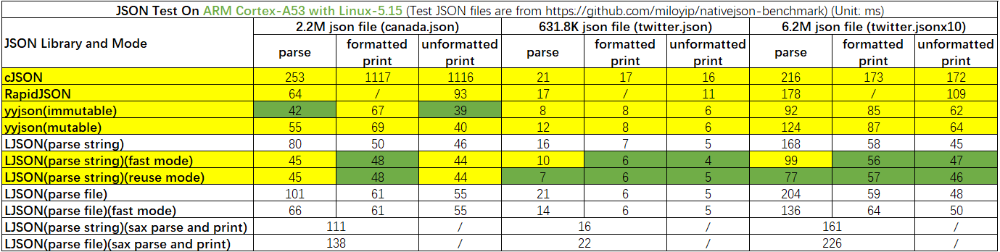
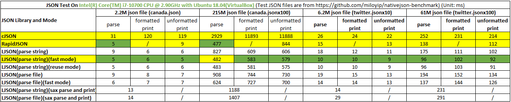
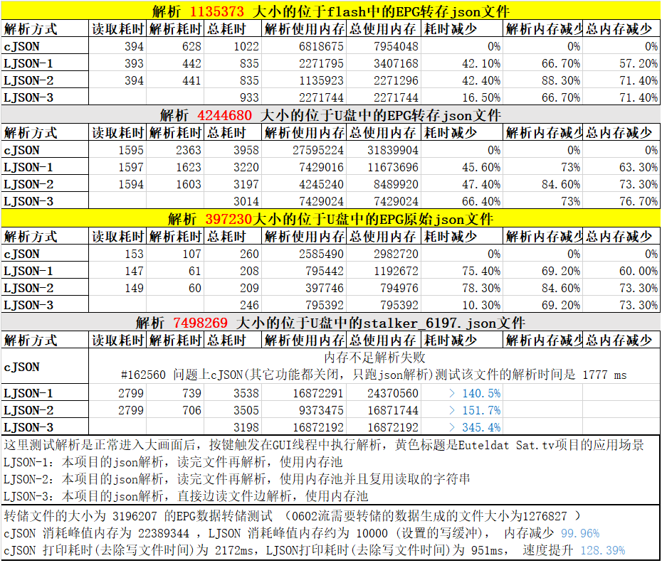

# LJSON 说明

[English Edition](./README.md)

LJSON 是一个远远快于 cJSON、大幅度快于 RapidJSON 的 C 实现的 JSON 库，他是目前最快的通用 JSON 库。
LJSON 支持 JSON 的解析、打印、编辑，提供 DOM 和 SAX 接口，I/O 支持字符串和文件，且完全支持 nativejson-benchmark 的测试用例。

## 功能特点

* 更快：打印和解析速度比 cJSON 和 RapidJSON 都要快，速度最高可比 CJSON 快19倍，比 Rapid JSON 快1倍，见测试结果
* 更省：提供多种省内存的手段，例如内存池、文件边读边解析、边打印边写文件、SAX方式的接口，可做到内存占用是个常数
* 更强：支持DOM和SAX风格的API，提供普通模式和内存池模式JSON的接口，支持字符串和文件作为输入输出(可扩展支持其它流)，扩展支持长长整形和十六进制数字
* 更友好：C语言实现，不依赖任何库，不含平台相关代码，只有一个头文件和库文件，和cJSON对应一致的接口，代码逻辑比任何JSON库都更清晰

## 编译运行

### 编译方法

* 直接编译

```sh
gcc -o ljson json.c json_test.c -O2 -ffunction-sections -fdata-sections -W -Wall
```

* [IMAKE](https://github.com/lengjingzju/cbuild-ng) 编译

```sh
make O=<编译输出目录> && make O=<编译输出目录> DESTDIR=<安装目录>
```

* 交叉编译

```sh
make O=<编译输出目录> CROSS_COMPILE=<交叉编译器前缀> && make O=<编译输出目录> DESTDIR=<安装目录>
```

### 运行方法

```sh
./json <json文件名> <测试序号0-7>
```

### 调试方法

* 设置 json.c 中的变量 `JSON_ERROR_PRINT_ENABLE` 的值为 `1` 后重新编译

### 错误检测

* 设置 json.c 中的变量 `JSON_STRICT_PARSE_MODE` 的值为 `0` / `1` / `2` 后重新编译
    * 0: 关闭不是常见的错误检测，例如解析完成后还剩尾后字符
    * 1: 检测更多的错误，且允许 key 为空字符串
    * 2: 除去 1 开启的错误检测之外，还关闭某些不是标准的特性，例如十六进制数字，第一个json对象不是array或object
        * 设置为2时 100% 符合 [nativejson-benchmark](https://github.com/miloyip/nativejson-benchmark) 的测试用例

## 性能测试

注：主要是测试速度，`O2` 优化等级且默认选项编译，测试文件来自 [nativejson-benchmark](https://github.com/miloyip/nativejson-benchmark) 项目

> 测试平台: Ambarella CV25M Board | CPU: ARM CortexA53 | OS: Linux-5.15<br>
> 测试结果: LJSON 比cJSON 解析最快可达 416%，打印最快可达 1644%，LJSON 比 RapidJSON 解析最快可达 96%，打印最快可达 45%



> 测试平台: PC | CPU: Intel i7-10700 | OS: Ubuntu 18.04 (VirtualBox)<br>
> 测试结果: :LJSON 比cJSON 解析最快可达 520%，打印最快可达 1600%，LJSON 比 RapidJSON 解析最快可达 44%，打印速度基本持平



> 测试平台: Nationalchip STB | CPU: CSKY | DDR3: 128MB, 533MHz | OS: ECOS<br>
> 注: 老版本测试结果，新版本删除了临时buffer，且解析速度提升了两倍



## json对象结构

使用 long long 类型支持，编译时需要设置 json.h 中的 `JSON_LONG_LONG_SUPPORT` 值为 1

```c
struct json_list_head {
    struct json_list_head *next, *prev;
};                                      // 双向链表

typedef enum {
    JSON_NULL = 0,
    JSON_BOOL,
    JSON_INT,
    JSON_HEX,
#if JSON_LONG_LONG_SUPPORT
    JSON_LINT,
    JSON_LHEX,
#endif
    JSON_DOUBLE,
    JSON_STRING,
    JSON_ARRAY,
    JSON_OBJECT
} json_type_t;                          // json对象类型

typedef union {
    bool vbool;
    int vint;
    unsigned int vhex;
#if JSON_LONG_LONG_SUPPORT
    long long int vlint;
    unsigned long long int vlhex;
#endif
    double vdbl;
} json_number_t;                        // json数字对象值

typedef union {
    json_number_t vnum;                 // json数字对象的值
    char *vstr;                         // json字符串对象的值
    struct json_list_head head;         // json结构体/数组对象的值
} json_value_t;                         // json对象值

typedef struct {
    struct json_list_head list;         // json链表节点
    char *key;                          // json对象的key
    json_type_t type;                   // json对象的类型
    json_value_t value;                 // json对象的值
} json_object;                          // json对象
```

* 使用双向链表管理json节点树，类似linux内核的list.h

## 经典编辑模式接口

```c
void json_memory_free(void *ptr);
```
* json_item_total_get: 释放经典编辑模式申请的内存或打印到字符串返回的指针

```c
int json_item_total_get(json_object *json);
```

* json_item_total_get: 获取节点总数

```c
void json_del_object(json_object *json);
json_object *json_new_object(json_type_t type);
json_object *json_create_item(json_type_t type, void *value);
json_object *json_create_item_array(json_type_t type, void *values, int count);

static inline json_object *json_create_null(void);
static inline json_object *json_create_bool(bool value);
static inline json_object *json_create_int(int value);
static inline json_object *json_create_hex(unsigned int value);
#if JSON_LONG_LONG_SUPPORT
static inline json_object *json_create_lint(long long int value);
static inline json_object *json_create_lhex(unsigned long long int value);
#endif
static inline json_object *json_create_double(double value);
static inline json_object *json_create_string(const char *value);
static inline json_object *json_create_array(void);
static inline json_object *json_create_object(void);

static inline json_object *json_create_bool_array(bool *values, int count);
static inline json_object *json_create_int_array(int *values, int count);
static inline json_object *json_create_hex_array(unsigned int *values, int count);
#if JSON_LONG_LONG_SUPPORT
static inline json_object *json_create_lint_array(long long int *values, int count);
static inline json_object *json_create_lhex_array(unsigned long long int *values, int count);
#endif
static inline json_object *json_create_double_array(double *values, int count);
static inline json_object *json_create_string_array(char **values, int count);
```

* json_del_object: 删除节点(并递归删除子节点)
* json_new_object: 创建指定类型的空节点
* json_create_item: 创建指定类型的有值节点
* json_create_item_array: 快速创建指定类型的数组节点，使用要点同上
* 要点：创建的节点使用完后需要使用`json_del_object`删除，但是如果把该节点加入了array或object，该节点无需再删除

```c
int json_string_strdup(const char *src, char **pdst);
static inline int json_set_key(json_object *json, const char *key);
static inline int json_set_string_value(json_object *json, const char *str);
```

* json_string_strdup: 修改LJSON中的字符串
* json_set_key: 修改节点的key(JSON_OBJECT类型下的子节点才有key)
* json_set_string_value: 修改string类型节点的value

```c
int json_get_number_value(json_object *json, json_type_t type, void *value);
int json_set_number_value(json_object *json, json_type_t type, void *value);

static inline bool json_get_bool_value(json_object *json);
static inline int json_get_int_value(json_object *json);
static inline unsigned int json_get_hex_value(json_object *json);
#if JSON_LONG_LONG_SUPPORT
static inline long long int json_get_lint_value(json_object *json);
static inline unsigned long long int json_get_lhex_value(json_object *json);
#endif
static inline double json_get_double_value(json_object *json);

static inline int json_set_bool_value(json_object *json, bool value);
static inline int json_set_int_value(json_object *json, int value);
static inline int json_set_hex_value(json_object *json, unsigned int value);
#if JSON_LONG_LONG_SUPPORT
static inline int json_set_lint_value(json_object *json, long long int value);
static inline int json_set_lhex_value(json_object *json, unsigned long long int value);
#endif
static inline int json_set_double_value(json_object *json, double value);
```

* json_get_number_value: 获取number类型节点的value，返回值: 正值(原有类型枚举值)表示成功有强制转换，0表示成功且类型对应，-1表示失败不是number类型
* json_set_number_value: 修改number类型节点的value，返回值说明同上

```c
int json_get_array_size(json_object *json);
json_object *json_get_array_item(json_object *json, int seq);
json_object *json_get_object_item(json_object *json, const char *key);
```

* json_get_array_size: 获取array类型节点的大小(有多少个一级子节点)
* json_get_array_item: 获取array类型节点的的第seq个子节点
* json_get_object_item: 获取object类型节点的指定key的子节点

```c
json_object *json_detach_item_from_array(json_object *json, int seq);
json_object *json_detach_item_from_object(json_object *json, const char *key);
```

* 将指定的子节点从array或object取下并返回
* 使用完成后`需要`使用`json_del_object`删除返回的子节点
* 注：使用内存cache的json`不需要`调用`json_del_object`删除返回的子节点

```c
int json_del_item_from_array(json_object *json, int seq);
int json_del_item_from_object(json_object *json, const char *key);
```

* 将指定的子节点从array或object删除

```c
int json_replace_item_in_array(json_object *array, int seq, json_object *new_item);
int json_replace_item_in_object(json_object *object, const char *key, json_object *new_item);
```

* 将array或object指定的子节点替换成new_item
* 如果原来的子节点不存在就直接新增new_item

```c
int json_add_item_to_array(json_object *array, json_object *item);
int json_add_item_to_object(json_object *object, const char *key, json_object *item);
```

* 将节点加入到array或object
* 如果该节点加入成功，`无需`再调用`json_del_object`删除该节点

```c
json_object *json_deepcopy(json_object *json);
int json_copy_item_to_array(json_object *array, json_object *item);
int json_copy_item_to_object(json_object *object, const char *key, json_object *item);
```

* json_deepcopy: 节点深度复制
* json_copy_item_to_xxxx: 将节点复制并加入到array或object
* 如果该节点加入成功，`还需要`再调用`json_del_object`删除原来传入的节点

```c
int json_add_new_item_to_object(json_object *object, json_type_t type, const char *key, void* value);

static inline int json_add_null_to_object(json_object *object, const char *key);
static inline int json_add_bool_to_object(json_object *object, const char *key, bool value);
static inline int json_add_int_to_object(json_object *object, const char *key, int value);
static inline int json_add_hex_to_object(json_object *object, const char *key, unsigned int value);
#if JSON_LONG_LONG_SUPPORT
static inline int json_add_lint_to_object(json_object *object, const char *key, long long int value);
static inline int json_add_lhex_to_object(json_object *object, const char *key, unsigned long long int value);
#endif
static inline int json_add_double_to_object(json_object *object, const char *key, double value);
static inline int json_add_string_to_object(json_object *object, const char *key, const char *value);
```

* json_add_new_item_to_object: 新建指定类型的节点，并将该节点加入object

```c
/*
 * The below APIs are also available to pool json:
 * json_item_total_get
 * json_get_number_value / ...
 * json_set_number_value / ...
 * json_get_array_size
 * json_get_array_item
 * json_get_object_item
 * json_detach_item_from_array
 * json_detach_item_from_object
 * json_add_item_to_array
 */
```

* `编辑(一般模式)`的一些API(内部没有调用malloc/free)也可以用于内存池
* 注意: pool模式时，json_detach_item_from_array/object返回的json节点不能使用`json_del_object`删除

## 内存池结构

```c
typedef struct {
    struct json_list_head list;         // 链表节点
    size_t size;                        // 内存大小
    char *ptr;                          // 首部地址
    char *cur;                          // 当前地址
} json_mem_node_t;

typedef struct {
    struct json_list_head head;         // json_mem_node_t挂载节点
    size_t mem_size;                    // 默认分配块内存大小
    json_mem_node_t *cur_node;          // 当前使用的内存节点
} json_mem_mgr_t;

typedef struct {
    json_mem_mgr_t obj_mgr;             // 对象节点的内存管理
    json_mem_mgr_t key_mgr;             // 字符串key的内存管理
    json_mem_mgr_t str_mgr;             // 字符串value的内存管理
} json_mem_t;
```

* 内存池原理是先分配一个大内存，然后从大内存中分配小内存
* 内存池只能统一释放申请

## 内存池编辑模式接口

```c
void pjson_memory_free(json_mem_t *mem);
void pjson_memory_init(json_mem_t *mem);
```

* pjson_memory_free: 释放json内存池管理的所有内存
* pjson_memory_init: 初始化json内存池管理结构
* 注：编辑模式初始化内存池后可修改mem_size
* 注：使用内存池前需要使用pjson_memory_init初始化内存池入口，全部使用完成后使用pjson_memory_free释放
* 注：绝对不要调用存在malloc, free之类的api，例如`json_new_object`和`json_del_object`等

```c
json_object *pjson_new_object(json_type_t type, json_mem_t *mem);
json_object *pjson_create_item(json_type_t type, void *value, json_mem_t *mem);
json_object *pjson_create_item_array(json_type_t item_type, void *values, int count, json_mem_t *mem);

static inline json_object *pjson_create_null(json_mem_t *mem);
static inline json_object *pjson_create_bool(bool value, json_mem_t *mem);
static inline json_object *pjson_create_int(int value, json_mem_t *mem);
static inline json_object *pjson_create_hex(unsigned int value, json_mem_t *mem);
#if JSON_LONG_LONG_SUPPORT
static inline json_object *pjson_create_lint(long long int value, json_mem_t *mem);
static inline json_object *pjson_create_lhex(unsigned long long int value, json_mem_t *mem);
#endif
static inline json_object *pjson_create_double(double value, json_mem_t *mem);
static inline json_object *pjson_create_string(const char *value, json_mem_t *mem);
static inline json_object *pjson_create_array(json_mem_t *mem);
static inline json_object *pjson_create_object(json_mem_t *mem);

static inline json_object *pjson_create_bool_array(bool *values, int count, json_mem_t *mem);
static inline json_object *pjson_create_int_array(int *values, int count, json_mem_t *mem);
static inline json_object *pjson_create_hex_array(unsigned int *values, int count, json_mem_t *mem);
#if JSON_LONG_LONG_SUPPORT
static inline json_object *pjson_create_lint_array(long long int *values, int count, json_mem_t *mem);
static inline json_object *pjson_create_lhex_array(unsigned long long int *values, int count, json_mem_t *mem);
#endif
static inline json_object *pjson_create_double_array(double *values, int count, json_mem_t *mem);
static inline json_object *pjson_create_string_array(char **values, int count, json_mem_t *mem);
```

* pjson_new_object: 在内存池中创建指定类型的空节点
* pjson_create_item: 在内存池中创建指定类型的有值节点
* pjson_create_item_array: 在内存池中创建(子节点指定类型)的array节点

```c
int pjson_string_strdup(const char *src, char **pdst, json_mem_mgr_t *mgr);
static inline int pjson_set_key(json_object *json, const char *key, json_mem_t *mem);
static inline int pjson_set_string_value(json_object *json, const char *str, json_mem_t *mem);
```

* pjson_string_strdup: 修改JSON中的字符串，该字符串在内存池中分配
* pjson_set_key: 修改json节点的key，该key在内存池中分配
* pjson_set_string_value: 修改 JSON_STRING 类型json节点的值，该值在内存池中分配

```c
int pjson_add_item_to_object(json_object *object, const char *key, json_object *item, json_mem_t *mem);
int pjson_add_new_item_to_object(json_object *object, json_type_t type, const char *key, void *value, json_mem_t *mem);

static inline int pjson_add_null_to_object(json_object *object, const char *key, json_mem_t *mem);
static inline int pjson_add_bool_to_object(json_object *object, const char *key, bool value, json_mem_t *mem);
static inline int pjson_add_int_to_object(json_object *object, const char *key, int value, json_mem_t *mem);
static inline int pjson_add_hex_to_object(json_object *object, const char *key, unsigned int value, json_mem_t *mem);
#if JSON_LONG_LONG_SUPPORT
static inline int pjson_add_lint_to_object(json_object *object, const char *key, long long int value, json_mem_t *mem);
static inline int pjson_add_lhex_to_object(json_object *object, const char *key, unsigned long long int value, json_mem_t *mem);
#endif
static inline int pjson_add_double_to_object(json_object *object, const char *key, double value, json_mem_t *mem);
static inline int pjson_add_string_to_object(json_object *object, const char *key, const char *value, json_mem_t *mem);
```

* pjson_add_item_to_object: 在内存池中的object加入子节点item
* pjson_add_new_item_to_object: 在内存池中创建指定类型的子节点，并加入到object

## DOM打印/DOM解析

```c
typedef struct {
    size_t str_len;                     // 打印到字符串时返回生成的字符串长度(strlen)
    size_t plus_size;                   // 打印生成的字符串的realloc的增量大小 / write buffer的缓冲区大小
    size_t item_size;                   // 每个json对象生成字符串的预估的平均长度
    int item_total;                     // json对象节点的总数
    bool format_flag;                   // 字符串是否进行格式化
    const char *path;                   // 文件保存路径
} json_print_choice_t;
```

* plus_size: 经典模式下打印字符串realloc的增量，或write buffer的缓冲区大小，最小值/默认值为 JSON_PRINT_SIZE_PLUS_DEF
* item_size: 每个json对象生成字符串的预估的平均长度，最小值/默认值为 JSON_UNFORMAT_ITEM_SIZE_DEF 和 JSON_FORMAT_ITEM_SIZE_DEF
* item_total: json对象节点的总数如果此值未设置，将自动计算总数；否则取默认值JSON_ITEM_NUM_PLUS_DEF
* format_flag: 格式化打印选项，`false: 压缩打印；true: 格式化打印`
* path: 如果path不为空，将直接边打印边输出到文件；否则是打印到一个大的完整字符串

```c
char *json_print_common(json_object *json, json_print_choice_t *choice);

static inline char *json_print_format(json_object *json, size_t *length);
static inline char *json_print_unformat(json_object *json, size_t *length);
static inline char *json_fprint_format(json_object *json, const char *path);
static inline char *json_fprint_unformat(json_object *json, const char *path);
```

* json_print_common: 打印通用接口
* json_print_format: 格式化打印成字符串的简写接口，`需要` `json_memory_free`释放返回的字符串
* json_print_unformat: 类似json_print_format，只是非格式化打印
* json_fprint_format: 格式化直接边打印边输出到文件的简写接口，成功返回"ok"字符串，`不需要` `json_memory_free`释放返回的字符串
* json_fprint_unformat: 类似json_fprint_format，只是非格式化打印

```c
typedef struct {
    size_t mem_size;                    // 内存池每个内存块的大小
    size_t read_size;                   // json读缓冲的初始大小
    size_t str_len;                     // 要解析的字符串长度
    bool reuse_flag;                    // 是否复用原始json字符串，原始json字符串会被修改
    json_mem_t *mem;                    // 内存池管理结构
    const char *path;                   // 要解析的json文件的路径
    char *str;                          // 要解析的json字符串的指针
} json_parse_choice_t;
```

* mem_size: 内存池每个内存块的大小，最小值为 (str_len / JSON_STR_MULTIPLE_NUM) 的值
* read_size: json读缓冲的初始大小，最小值 JSON_PARSE_READ_SIZE_DEF
* str_len: 要解析的字符串长度 strlen(str)，使用内存池时该参数有效，如果为0，json_parse_common会自己计算一次
* path: 要解析的json文件，str 和 path 有且只有一个有值
* str: 要解析的json字符串，str 和 path 有且只有一个有值

```c
json_object *json_parse_common(json_parse_choice_t *choice);
static inline json_object *json_parse_str(char *str, size_t str_len);
static inline json_object *json_fast_parse_str(char *str, size_t str_len, json_mem_t *mem);
static inline json_object *json_reuse_parse_str(char *str, size_t str_len, json_mem_t *mem);
static inline json_object *json_parse_file(const char *path);
static inline json_object *json_fast_parse_file(const char *path, json_mem_t *mem);
```

* json_parse_common: 解析通用接口
* json_parse_str: 类似cJSON的经典字符串解析的简写接口，用完后需要`json_del_object`释放返回的管理结构
* json_fast_parse_str: 使用内存池的字符串解析的简写接口，使用前必须使用`pjson_memory_init`初始化mem，用完后需要`pjson_memory_free`释放
* json_reuse_parse_str: 使用内存池极速解析并复用原始字符串，`会修改传入的字符串，使用过程中不要释放原始的str` , `速度最快，占用内存最少`
* json_parse_file: 类似json_parse_str，只是从文件边读边解析
* json_fast_parse_file: 类似json_parse_str， 只是边读文件边解析

## SAX打印/SAX解析

使用 SAX APIs 编译时需要设置 json.h 中的 `JSON_SAX_APIS_SUPPORT` 值为 1

```c
typedef struct {
    char escaped;
    char alloced;
    size_t len;
    char *str;
} json_sax_str_t; // 字符串的值

typedef enum {
    JSON_SAX_START = 0,
    JSON_SAX_FINISH
} json_sax_cmd_t;                       // 数组/指针类型节点的开始/结束

typedef void* json_sax_print_hd;

void json_saxstr_update(json_sax_str_t *sstr);
```

* json_sax_str_t: 如果alloced是1，表示该字符串是malloc的以'\0'结尾；否则表示该字符串是截取大字符串的一段，长度为len，需要你自己复制分离
* json_sax_cmd_t: JSON_ARRAY / JSON_OBJECT 的开始和结束
* json_sax_print_hd: 实际是json_sax_print_t指针
* json_saxstr_update: 更新 json_sax_str_t 中的escaped和len，如果传入的len大于0， 此函数什么都不做

```c
json_sax_print_hd json_sax_print_start(json_print_choice_t *choice);
static inline json_sax_print_hd json_sax_print_format_start(int item_total);
static inline json_sax_print_hd json_sax_print_unformat_start(int item_total);
static inline json_sax_print_hd json_sax_fprint_format_start(int item_total, const char *path);
static inline json_sax_print_hd json_sax_fprint_unformat_start(int item_total, const char *path);
```

* json_sax_print_start: sax打印时必须先调用此函数，进行资源初始化并获取句柄 json_sax_print_hd
  * 如果打印到字符串，最好给一个item_total值，用于计算生成字符串的增量

```c
int json_sax_print_value(json_sax_print_hd handle, json_type_t type, const char *key, const void *value);
static inline int json_sax_print_null(json_sax_print_hd handle, json_sax_str_t *key);
static inline int json_sax_print_bool(json_sax_print_hd handle, json_sax_str_t *key, bool value);
static inline int json_sax_print_int(json_sax_print_hd handle, json_sax_str_t *key, int value);
static inline int json_sax_print_hex(json_sax_print_hd handle, json_sax_str_t *key, unsigned int value);
#if JSON_LONG_LONG_SUPPORT
static inline int json_sax_print_lint(json_sax_print_hd handle, json_sax_str_t *key, long long int value);
static inline int json_sax_print_lhex(json_sax_print_hd handle, json_sax_str_t *key, unsigned long long int value);
#endif
static inline int json_sax_print_double(json_sax_print_hd handle, json_sax_str_t *key, double value);
static inline int json_sax_print_string(json_sax_print_hd handle, json_sax_str_t *key, json_sax_str_t *value);
static inline int json_sax_print_array(json_sax_print_hd handle, json_sax_str_t *key, json_sax_cmd_t value);
static inline int json_sax_print_object(json_sax_print_hd handle, json_sax_str_t *key, json_sax_cmd_t value);
```

* json_sax_print_value: sax 条目通用打印接口，如果要打印节点的父节点是object，key必须有值；其它情况下key填不填值均可
  * array 和 object 要打印两次，一次值是 `JSON_SAX_START` 表示开始，一次值是 `JSON_SAX_FINISH` 表示完成
  * 传入key时可以先不用`json_saxstr_update` 计算长度

```c
char *json_sax_print_finish(json_sax_print_hd handle, size_t *length);
```

* json_sax_print_finish: sax打印完成必须调用此函数，释放中间资源并返回字符串
  * 打印成字符串时，该函数返回打印的字符串， `需要` `json_memory_free`释放返回的字符串
  * 直接边打印边输出到文件时，成功返回"ok"字符串，`不需要` `json_memory_free`释放返回的字符串

```c
typedef union {
    json_number_t vnum;
    json_sax_str_t vstr;
    json_sax_cmd_t vcmd;            // array, object
} json_sax_value_t;

typedef struct {
    json_type_t type;
    json_sax_str_t key;
} json_sax_depth_t;

typedef enum {
    JSON_SAX_PARSE_CONTINUE = 0,
    JSON_SAX_PARSE_STOP
} json_sax_ret_t;

typedef struct {
    int total;
    int count;
    json_sax_depth_t *array;
    json_sax_value_t value;
} json_sax_parser_t;

typedef json_sax_ret_t (*json_sax_cb_t)(json_sax_parser_t *parser);

typedef struct {
    char *str;
    const char *path;
    size_t read_size;
    json_sax_cb_t cb;
} json_sax_parse_choice_t;
```

* json_sax_value_t: 解析到的json节点的值
* json_sax_depth_t: 记录key和type
* json_sax_ret_t: JSON_SAX_PARSE_CONTINUE 表示SAX解析器继续解析，JSON_SAX_PARSE_STOP 表示中断解析
* json_sax_cb_t: 调用者自己填写的回调函数，必须有值，返回 `JSON_SAX_PARSE_STOP` 表示中断解析并返回
* json_sax_parser_t: 传给回调函数的值
  * array 是 array/object `类型+key` 的层次结构，total表示当前分配了多少层次，count表示当前用了多少层次，即当前层为 `array[count-1]`
  * value 是当前层的值
* json_sax_parse_choice_t: 参考 `json_parse_choice_t` 说明

```c
int json_sax_parse_common(json_sax_parse_choice_t *choice);
static inline int json_sax_parse_str(char *str, size_t str_len, json_sax_cb_t cb);
static inline int json_sax_parse_file(const char *path, json_sax_cb_t cb);
```

* json_sax_parse_common: sax解析通用接口，因为不需要保存json树结构，所以不需要使用内存池
* json_sax_parse_str: 从字符串解析的快捷接口
* json_sax_parse_file: 从文件边读边解析的快捷接口

## 参考代码

* 参考了[cJSON](https://github.com/DaveGamble/cJSON)的实现，其中utf16_literal_to_utf8函数完全来自cJSON

## 联系方式

* Phone: +86 18368887550
* wx/qq: 1083936981
* Email: lengjingzju@163.com 3090101217@zju.edu.cn
