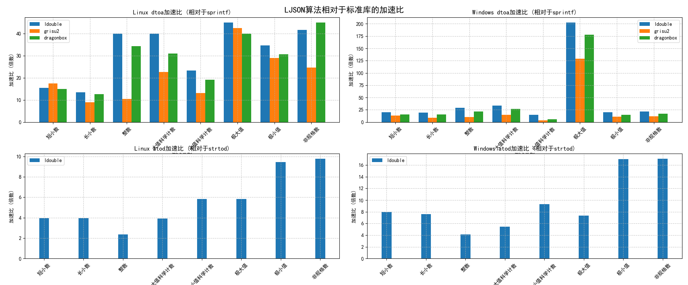

# LJSON 说明

[English Edition](./README.md)

[LJSON：全能、高性能、真流式的 C 语言 JSON 引擎和数值引擎](./notes/introduction_zh-cn.md)

[LJSON 高性能优化的平衡之道：哲学思维与工程实践](./notes/optimization_zh-cn.md)

[yyjson ≠ 万能王者：它只是 LJSON DOM 复用模式的一个特化版本](./notes/cmp_yyjson_zh-cn.md)

[一种有限定义域内快速整除的实现方法](./notes/fastdiv_zh-cn.md)

## 概述

LJSON 是一款面向极致性能设计的双模数据处理引擎，既是符合JSON5标准的全能JSON处理器，也是业界领先的数值字符串双向转换工具库。

* 双重核心能力：
    * JSON全能处理：完整支持JSON5规范，提供DOM/SAX双解析模式，文件流式处理能力
    * 数值转换引擎：独创ldouble算法实现浮点字符串互转，性能碾压传统方案

> 注：64位操作系统上，从v5.0.0版本开始，对象字节由40字节降低到32字节，解析速度提升5%~10%，和v3.x.x版本不兼容。

## 主要特性

### LJSON特性

* 极速JSON处理：远超cJSON，大幅领先RapidJSON，小幅领先yyjson的解析/打印性能
* 先进浮点转换：内置ldouble算法，比标准库快10~70倍，比行业方案快10%~100%
* 完整JSON5支持：十六进制、注释、尾逗号等现代JSON特性（部分特性需要启用json.c中的特定宏）
* 多场景优化：DOM/SAX双模式、内存池、内存复用、文件流处理等高效内存管理
    * LJSON文件流解析时是边读取边解析，打印时是边打印边写入，而不是yyjson读完再解析，打印完再写入的伪流模式
    * 内存复用指：1.原始数据直接作为键和字符串的存储点；2. 多次解析和打印时一直复用同一块内存，库内部都无需进行堆内存分配
    * SAX和文件流配合使用可将内存占用变为常数级，即使1GB的JSON文件也可以仅用KB级的内存转换为格式化的JSON文件
* 多数据类型支持：支持长整型、十六进制数字等扩展类型，**支持二进制数据扩展(格式为 `<len:data>` )**
* 开发者友好：参考cJSON的接口设计，纯C实现，无第三方库依赖，支持多种编译器和处理器架构

### LDOUBLE算法特性

* 字符串转数值算法比标准库快1~10倍
* 浮点数转字符串LDOUBLE算法为追求性能不完全符合IEEE-754标准，拥有17位精度，且始终输出最短精确表示
    * LDOUBLE算法的耗时仅为sprintf的1.5%-10%（即快10-70倍）
    * LDOUBLE算法除一位小数外一般显著快于grisu2算法，特别是科学计数法表示时，可快100%以上
    * LDOUBLE算法绝大多数情况下快于dragonbox算法 ，特别是科学计数法表示时，可快30%以上

## 编译运行

### 编译方法

* 直接编译

```sh
gcc -o ljson json.c jnum.c json_test.c -O2 -ffunction-sections -fdata-sections -W -Wall
```

* [IMAKE](https://github.com/lengjingzju/cbuild-ng) 编译

```sh
make O=<编译输出目录> && make O=<编译输出目录> DESTDIR=<安装目录>
```

* 交叉编译

```sh
make O=<编译输出目录> CROSS_COMPILE=<交叉编译器前缀> && make O=<编译输出目录> DESTDIR=<安装目录>
```

* 选择浮点数转字符串算法 `gcc -DJSON_DTOA_ALGORITHM=n` 或 `make DTOA=n`， n可能为 0 / 1 / 2 / 3
    * 0: 个人实现的 ldouble 算法
    * 1: C标准库的 sprintf
    * 2: 个人优化的 grisu2 算法
    * 3: 个人优化的 dragonbox 算法
<br>

* 选择大查找表或小查找表 `gcc -DUSING_SMALL_LUT=n` 或 `make SMALL=n`， n可能为 0 / 1
    * 0: 大查找表，速度可能更快一些
    * 1: 小查找表，使用小查找表代码段小约5KB
<br>

* Windows MSC
    * 使用 `Visual Studio 2022` 打开 `MSC\ljson\ljson.sln`

### 运行方法

```sh
./ljson <json文件名> <测试序号0-7>
```

### 调试方法

* 设置 json.c 中的变量 `JSON_ERROR_PRINT_ENABLE` 的值为 `1` 后重新编译

### 解析配置

* `#define JSON_PARSE_SKIP_COMMENT         1` : 是否允许类似C语言的单行注释和多行注释(JSON5特性)
* `#define JSON_PARSE_LAST_COMMA           1` : 是否允许JSON_ARRAY或JSON_OBJECT的最后一个元素的末尾有逗号(JSON5特性)
* `#define JSON_PARSE_EMPTY_KEY            0` : 是否允许键为空字符串
* `#define JSON_PARSE_SPECIAL_CHAR         1` : 是否允许字符串中有特殊的字符，例如换行符(JSON5特性)
* `#define JSON_PARSE_SPECIAL_QUOTES       1` : 是否允许字符串值可以使用单引号，键值可以使用单引号或无引号(JSON5特性)
* `#define JSON_PARSE_HEX_NUM              1` : 是否允许十六进制的解析(JSON5特性)
* `#define JSON_PARSE_SPECIAL_NUM          1` : 是否允许特殊的数字，例如前导0，加号，无整数的浮点数等，例如 `+99` `.1234` `10.` `001` 等(JSON5特性)
* `#define JSON_PARSE_SPECIAL_DOUBLE       1` : 是否允许特殊的double值 `NaN` `Infinity` `-Infinity`(JSON5特性)
* `#define JSON_PARSE_SINGLE_VALUE         1` : 是否允许不是JSON_ARRAY或JSON_OBJECT开头的JSON值
* `#define JSON_PARSE_FINISHED_CHAR        0` : 是否解析完成后忽略检查字符串尾部的合法性

注：

* 如果需要100%符合 [nativejson-benchmark](https://github.com/miloyip/nativejson-benchmark)，需要将 `JSON_PARSE_EMPTY_KEY` 置为1，其它值全部置为0。
* `JSON_PARSE_SKIP_COMMENT` 和 `JSON_PARSE_SPECIAL_QUOTES` 置为1时会显著影响解析速度。

## 性能测试

### 测试代码

其它json的测试代码位于benchmark目录，将对应的文件放在对应json工程的根目录即可

```sh
gcc -o cjson cjson_test.c cJSON.c -O2               # cJSON
g++ -o rapidjson rapidjson_test.c -Iinclude -O2     # RapidJSON
gcc -o yyjson yyjson_test.c src/yyjson.c -Isrc -O2  # yyjson
gcc -o strdup strdup_test.c -O2                     # strdup和strlen
```

测试脚本

```sh
#!/bin/bash

src=$1

if [ -z $src ] || [ ! -e $src ]; then
	echo "Usage: $0 <json file>"
	exit 1
fi

run_cmd() {
	printf "%-15s " $1
	eval $@
	sync
	sleep 0.1
}

for i in `seq 1 7`; do
	run_cmd ./ljson $src $i
done

run_cmd ./cjson $src
run_cmd ./rapidjson $src
run_cmd ./yyjson $src
run_cmd ./yyjson $src 1
run_cmd ./strdup $src
```

测试模式

* ljson提供7种测试模式
    * 1: 普通DOM模式，使用malloc申请内存，解析和打印都为字符串
    * 2: 快速DOM模式，申请大内存，然后内存从大内存分配(无法单独释放小内存)，解析和打印都为字符串
    * 3: 重用DOM模式，申请大内存，然后内存从大内存分配(无法单独释放小内存)，且键和字符串值重用原始解析字符串，解析和打印都为字符串
    * 4: 文件DOM模式，无需读完文件再解析或打印完再写入，使用malloc申请内存，边读文件边解析，边打印边写入文件
    * 5: 快速文件DOM模式，无需读完文件再解析或打印完再写入，申请大内存，然后内存从大内存分配(无法单独释放小内存)，边读文件边解析，边打印边写入文件
    * 6: 普通SAX模式，解析和打印都为字符串
    * 7: 文件SAX模式，无需读完文件再解析，边读文件边解析
* yyjson提供两种测试模式：unmutable 和 mutable 模式

### JSON测试结果

注1：主要是测试速度，`O2` 优化等级且默认选项编译，测试文件来自 [nativejson-benchmark](https://github.com/miloyip/nativejson-benchmark) 项目

注2：由于功能增加、逻辑优化等修改，最新版本不一定符合下面测试结果，例如使用了更精确的数字处理，浮点数解析性能会下降(处理canada.json)，优化复用模式(模式3)分支预测，解析性能会上升。

> 测试平台: ARM64开发板 | CPU: ARM CortexA53 | OS: Linux-5.15<br>
> 测试结果: LJSON 比cJSON 解析最快可达 475%，打印最快可达 2836%，LJSON 比 RapidJSON 解析最快可达 131%，打印最快可达 147% (耗时含文件读写时间)


> 测试平台: PC | CPU: Intel i7-10700 | OS: Ubuntu 18.04 (VirtualBox)<br>
> 测试结果: LJSON 比cJSON 解析最快可达 560%，打印最快可达 3184%，LJSON 比 RapidJSON 解析最快可达 75%，打印最快可达 133% (耗时含文件读写时间)


> 测试平台: PC | CPU: Intel i7-1260P | OS: Debian 13 (VMWare) | LJSON_v5.0.2<br>
> 测试结果: LJSON 比cJSON 解析最快可达 543%，打印最快可达 2112%，LJSON 比 RapidJSON 解析最快可达 166%，打印最快可达 215% (耗时不含文件读写时间)


### 数值转换测试结果

**测试方法**

```sh
make O=obj
./benchmark/benchmark.sh obj
./benchmark/benchmark.sh obj atod
```

> 测试平台: PC | CPU: Intel i7-1260P | OS: Ubuntu 20.04 (VMWare)<br>
> 测试平台: PC | CPU: Intel i7-1260P | OS: Windows11 (MSVC 2023)<br>
> 测试命令(dtoa): `./jnum_test <num> 10000000` # 测试千万次<br>
> 测试命令(atod): `./jnum_test a <num> 10000000` # 测试千万次<br>
> 测试结果(dtoa): ldouble比sprintf快一个数量级(某些用例可快40倍)，也比grisu2和dragonbox快一些；ldouble在精度范围内可以保证最短，和printf输出一致<br>
> 测试结果(atod): ldouble比strtod大多数情况下快2~3倍(某些用例可快10倍)



## 接口说明

见 `json.h`  `jnum.h` 文件。

## 零堆内存分配模式

对于小JSON文件解析打印时，推荐使用零堆内存分配模式，LJSON库只在第一次处理时分配内存，后续处理LJSON库内部可能不会进行任何堆内存分配。

* 解析存储json对象一直复用内存池mem
* 解析存储字符串值复用原始字符串(即原始字符串会被修改，且使用json过程中不能释放)
* 获取 `JSON_ARRAY` / `JSON_OBJECT` 下的对象可使用 `json_get_items` 加速，可一直复用此对象内存(每个级别都要有单独的 `json_items_t` )
* 打印一直复用 `json_print_ptr_t` 的成员 `p`

```c
size_t len = 0;

// 初始化只做一次(解析)
json_mem_t mem;
pjson_memory_init(&mem);
/* obj_mgr需要设置合适的值以便一个内存块可以存下所有的object, 如果是不复用原始字符串，其它2个mgr也需要设置 */
mem.valid = true;
mem.obj_mgr.mem_size = max_data_size;

// 解析加速复用items
json_items_t items;
memset(&items, 0, sizeof(items));

// 初始化只做一次(打印)
json_print_ptr_t ptr = {PRINT_BUF_LEN, 0};

// 业务循环
while (1) {
    /* ---- 接收消息JSON解析 ---- */
    json_object *json = json_reuse_parse_str(buf, &len, &mem);
        // 获取某JSON_ARRAY下的所有数据
        if (json_get_items(array, &items) < 0)
            return -1;
        for (size_t i = 0; i < items.count; ++i) {
            ids.push_back(json_get_lint_value(items.items[i].json));
        }

    /* ----- 业务处理逻辑 ---- */

    /* ---- 发送消息JSON打印 ----*/
    json_sax_print_hd hd = json_sax_print_unformat_start(100, &ptr); // 开始打印(复用ptr)
    json_sax_print_object(hd, NULL, JSON_SAX_START); // 顶层左花括号
        // 打印某JSON_OBJECT下的数据
        json_sax_print_string(hd, &key, sval);
        // 打印某JSON_ARRAY下的所有数据
        json_sax_print_array(hd, &key, JSON_SAX_START);
        for (const auto &v : ids) {
            json_sax_print_lint(hd, NULL, v);
        }
        json_sax_print_array(hd, NULL, JSON_SAX_FINISH);
    ret |= json_sax_print_object(hd, NULL, JSON_SAX_FINISH); // 顶层右花括号
    json_sax_print_finish(hd, len, &ptr) // 结束打印，生成的字符串位于ptr.p或返回值

    /* ----- JSON内存池处理 ---- */
    // 不再需要json结构，只保留第一个链表节点
    pjson_memory_refresh(&mem);
}

// 销毁资源只做一次(解析)
json_free_items(&items);
pjson_memory_free(&mem);

// 销毁资源只做一次(打印)
json_memory_free(ptr.p);
```

## 参考代码

* 参考了[cJSON](https://github.com/DaveGamble/cJSON)的实现，其中utf16_literal_to_utf8函数完全来自cJSON

## 联系方式

* Phone: +86 18368887550
* wx/qq: 1083936981
* Email: lengjingzju@163.com 3090101217@zju.edu.cn
